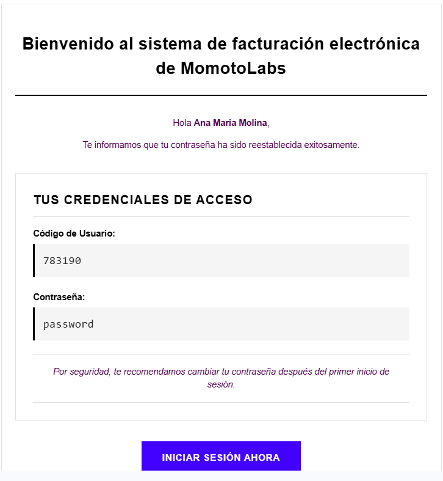

Para acceder al sistema se requiere la dirección de correo electrónico registrada o el código de empleado, el cual se genera de forma automática. Las credenciales de acceso son enviadas directamente al correo del usuario.

Al iniciar sesión por primera vez en el sistema, es obligatorio cambiar la contraseña asignada previamente para garantizar la seguridad de la cuenta.

Al ingresar el código de empleado y la nueva contraseña se genera el cambio y muestra un mensaje que indica que esta fue restablecida y que se puede iniciar sesión con la nueva contraseña. 

## Selección de Sucursal y Punto de venta para acceder al sistema ##

Al iniciar sesión como Operativo o Gerente con sus credenciales, el sistema despliega una pantalla en la que se debe seleccionar la sucursal y el punto de venta asignados previamente desde la sección del Administrador. Es obligatorio elegir una opción en cada campo para poder acceder al factura

Una vez seleccionada la sucursal y el punto de venta, al dar clic en el **botón Continuar** se habilita el panel principal del sistema

 Desde donde el usuario podrá acceder a todas las funciones del facturador.

Se explicara detalladamente cada sección del facturador 

## Dashboard principal del facturador ##

El Dashboard principal del facturador muestra los siguientes elementos:

**El banner indicador de entorno:** se muestra en la parte superior de la pantalla y permite identificar en qué entorno está funcionando el sistema:

- **Modo prueba:** utilizado para realizar validaciones y pruebas antes de la operación real.

- **Modo producción:** corresponde al entorno oficial donde se registran las transacciones reales.

Este indicador ayuda a los usuarios a trabajar con mayor seguridad, evitando confusiones entre pruebas y operaciones oficiales.

