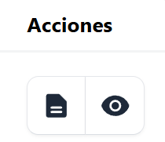

Una factura se anula cuando presenta errores o deja de ser válida, por lo que no puede utilizarse para fines fiscales.

Al anular una factura se debe:

-  Registrar que el documento carece de validez legal

-  Indicar y justificar el motivo de la anulación

- En caso necesario, emitir una nueva factura con la información corregida

## ¿Comó anular un documento? ##

Para poder anular una factura, hay que posicionarse en el menú principal, y dar clic en la sección Facturas

Del listado de facturas desplegado, ubique la factura correspondiente. Luego, en la sección de Acciones, seleccione el ícono **Anular documento**

Aparecera la siguiente pantalla 

## Datos generales ##

La factura puede anularse por diferentes motivos. 

El formulario de anulación mostrará la información de la factura seleccionada, incluyendo:

- Número de control

-  Sello de recepción

- Código de generación

- Tipo de factura

- Monto

- Fecha

## Llenado de formulario de anulación ##

Se solicita: 

•	Tipo de anulación (rescindir de la operación realizada, otro; en este se puede hacer reemplazo del documento)

•	Motivo de la anulación 

•	Nombre del solicitante 

•	Tipo de documento del solicitante (DUI, NIT, Otro, Pasaporte, Carnet de residente)
•	Número de documento 

Completar los datos requeridos 

Dar clic en el botón **Anular documento**

Se muestra un mensaje que indica que la Factura fue anulada con éxito

## Listado de facturas anuladas ##

Luego de haber completado el proceso de anulación del documento este sera visualizado desde la sección de anulaciones que se encuentra en el menú principal 

Automáticamente de despliega la siguiente pantalla. donde se listan las facturas anuladas 

Se detalla la anulación por:

- Factura (Código y tipo de factura)

- Motivo de anulación 

- Datos del solicitante (Nombre y número de documento)

- Datos del responsable (Nombre y número de documento)

- Fecha y hora de la anulación

## Accciones ##

Dentro de la vista de facturas anuladas existen acciones que se pueden ejecutar en relación a los documentos invalidados 

- Ver detalles de la anulación
 
 - Ver documento 

 
 ## Ver detalles de anulación ##

 Para ver detalles del documento anulado hay que dar clic en el siguiente 

Al dar clic se despliega la siguiente pantalla con la información del documento anulado 

Esta pantalla contiene:

**Detalles del documento anulado**

- Número de control 

- Código de generación 

- Sello de recepción

- Tipo de documento 

- Fecha

- Monto total 

**Detalles de anulación**

- Sello de anulación 

- Fecha de anulación 

- Tipo de anulación 

- Documento que lo reemplaza (si aplica)

- Motivo 

- Nombre del solicitante 

- Tipo de documento del solicitante 

- Número de documento del solicitante 

- Nombre del responsable 

- Tipo de documento del responsable 

- Número de documento del responsable 

## Ver documento anulado ##

Para visualizar el documento anulado dar clic en el siguiente icono:

Se muestra la vista previa de la factura con un indicador en color rojo que señala que el documento ha sido anulado

## Filtro y búsqueda de facturas anuladas ##

Para agilizar la localización de documentos, el sistema permite realizar búsquedas mediante el código de generación, mediante la siguiente casilla de búsqueda:

Se pueden realizar filtro de docuentos por su tipo:

 

