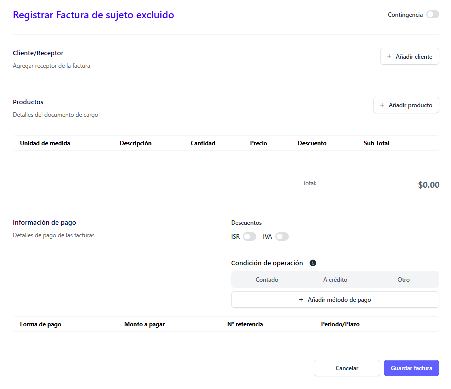
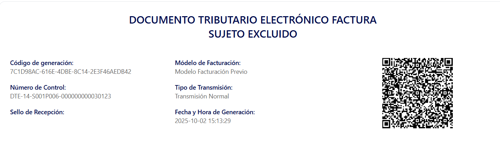
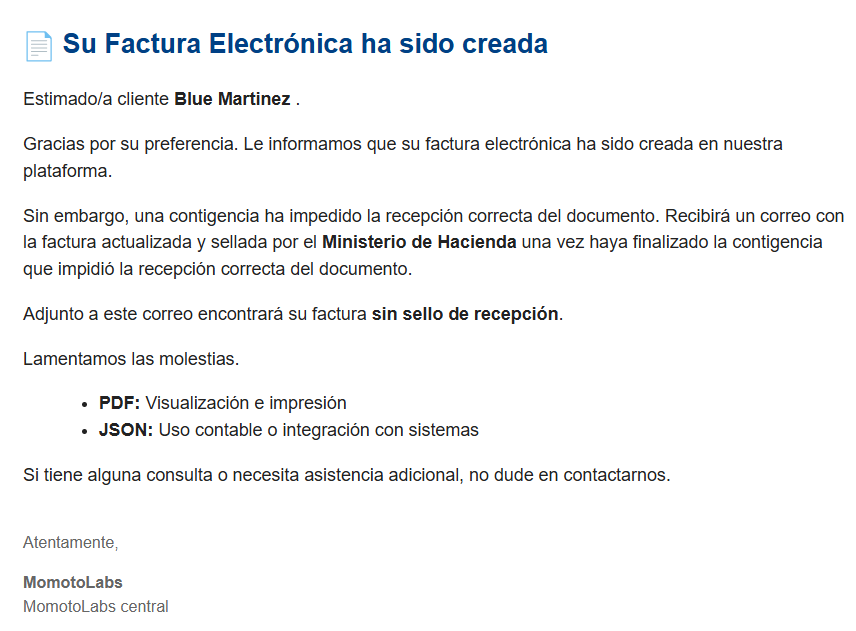
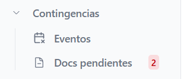
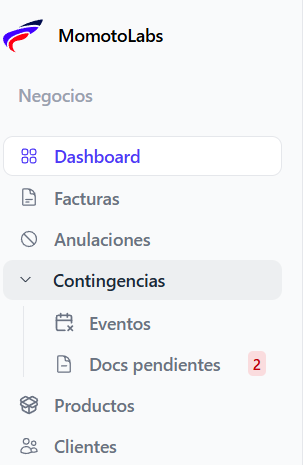

## ¿Qué es una contingencia? ##

Un proceso de contingencia consiste en una alternativa temporal que se aplica cuando no es posible generar una factura electrónica de manera habitual. Este procedimiento se utiliza en situaciones excepcionales, como fallos en el sistema del proveedor o interrupciones en la conexión a internet.

## ¿Comó enviar un documento a contingencia? ##

Para poder enviar un documento a contingencia, hay que ingresar a la sección de **Facturas**

 Al desplegarse la pantalla principal de **Facturas** haz clic en el botón “Nueva factura electrónica”

 Al seleccionarlo, se abrirá un modal en el que podrás elegir el tipo de factura que deseas generar de la lista disponible 

 

 **Independientemente del tipo de factura que se seleccione el proceso es el mismo**

Después de seleccionar el tipo de documento y hacer clic en el botón Confirmar, el sistema mostrará el formulario de creación de la factura.

 

 En la parte superior derecha del formulario de creación de la factura, se visualiza un swicth 

 

**Importante:**

Al completar todos los campos requeridos para generar la factura, si se presenta algún inconveniente en la emisión, asegúrese de activar el switch

Una vez completado este requisito, haga clic en el botón Guardar factura para continuar con el proceso

Automáticamente se generará la vista previa de la factura. En esta se podrá observar que la sección correspondiente al Sello del Ministerio de Hacienda aparece vacía, ya que **es necesario solventar la contingencia para que el documento pueda obtener el sello oficial.**

## Correo de notificación de contingencia ##

Se notificará al correo electrónico del cliente que la factura ha sido creada exitosamente, pero se encuentra en estado de contingencia. Es necesario que se resuelva la contingencia para proceder con su sellado oficial.

La factura se envía automáticamente a la sección de Contingencias del menú principal, donde se listan todas las facturas emitidas bajo esta modalidad y que están a la espera de ser solventadas para su sellado correspondiente por el Ministerio de Hacienda, dentro de esta sección en los documentos pendientes se enumeran los documentos que faltan procesar

## Menú contingencias ##

Para visualizar todas las facturas que estan dentro de contingencias, posicionarse en el menú principal y dar clic en **Contingencias** 

En esta sección se tiene acceso a:

 - Eventos

 - Listado de documentos pendientes

 
