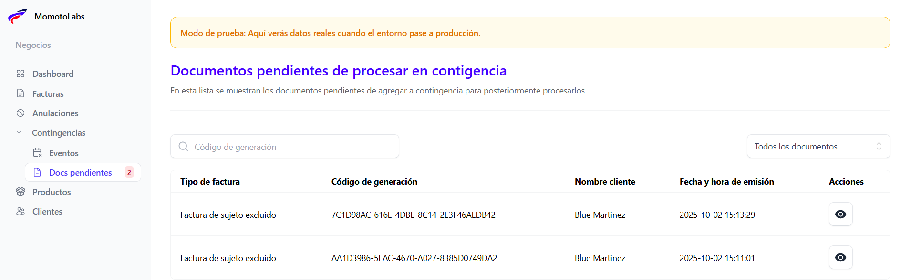
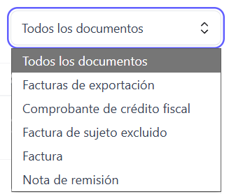
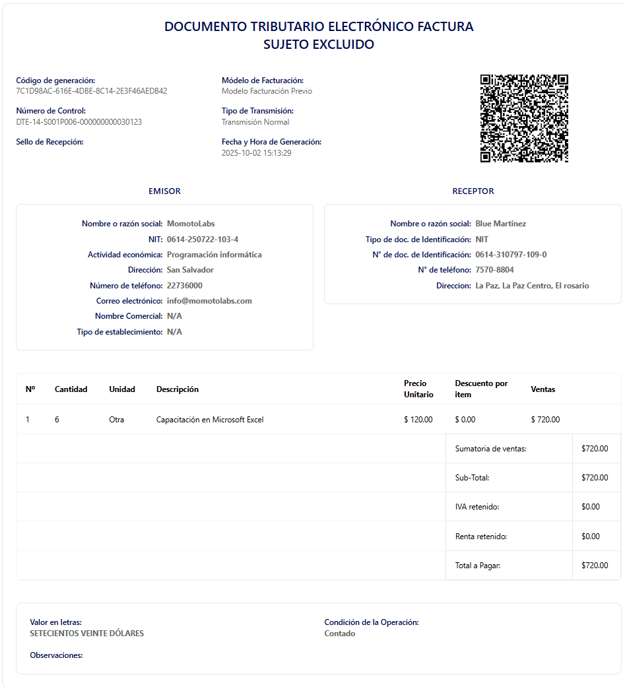

En esta sección se listan los documentos generados en modo contingencia que aún no han sido procesados por el Ministerio de Hacienda. Desde aquí, el usuario puede dar seguimiento y realizar las acciones necesarias para completar su validación.

Está tabla posee los siguientes campos:

- Tipo de factura 

- Código de generación

- Nombre del cliente

- Fecha y hora de emisión

- Acciones (Ver documento)

## Búsqueda de documentos por código de generación ##

Para agilizar la búsqueda de documentos, estos pueden localizarse utilizando su código de generación, mediante la siguiente casilla:

## Filtro de documentos por tipo ##

El filtro de documentos tambien se puede realizar por tipo

## Acciones ##

En las acciones de la tabla se muestra el siguiente icono:

Al dar clic se muestra la vista previa del print de la factura

