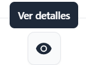

Para editar un evento de contingencia hay que posicionarse en el menú principal en la sección de **Eventos**

Posicionarse en el evento que se desea editar, y dar clic en **Ver detalles**

**Nota: Se editan contingencias con estado de rechazado**

Al desplegarse el evento, dentro de los detalles en la parte superior derecha se observa el botón **Editar evento de contingencia**

Al dar clic en este botón se despliega el formulario de edición

En esta sección se pueden editar los siguientes campos:

- tipo de contingencia 
- motivo de contingencia
- fecha de inicio de la contingencia
- Hora de inicio
- Fecha de fin de la contingencia
- Hora de fin   

Dar clic en el botón guardar y la edición se ejecuta.

