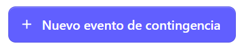
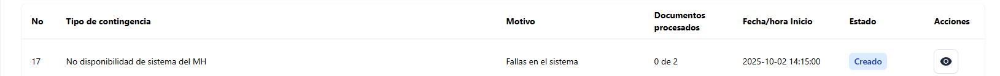

## ¿Qué es un evento de contingencia?

Esta función permite registrar un evento de contingencia cuando, por causas técnicas o de conexión, no es posible emitir una factura de forma normal. Al crear el evento, el sistema habilita la emisión de documentos en modo contingencia para garantizar la continuidad de la operación comercial.

Para crear un evento de contingencia hay que posicionarse en el menú principal y dar clic en **Contingencias** y buscar la sección **Eventos**

Al dar clic se despliega la siguiente pantalla:

Donde se muestran los eventos creados, donde se muestra la siguiente información:

- Tipo de contingencia
- Motivo 
- Indicador de documentos procesados en el evento
- Fecha y hora de inicio del evento
- Estado del evento (Completado, Procesando, Creado y Rechazado)
- Acciones (Ver detalles de la contingencia)

## ¿Comó crear un nuevo evento de contingencia?

Para crear un nuevo evento de contingencia, dar clic en el bot►2n que se encuentra en la parte superior derecha de la pantalla

Al dar clic se despliega el siguiente formulario:

El formulario solicita los siguientes campos:

- 	Tipo de contingencia 

- 	Motivo de la contingencia (descripción del porque se generó la contingencia)

-	Periodo de facturas en contingencia (fecha de inicio de contingencia, esta se habilita al seleccionar la fecha de fin)

-	Hora de inicio de contingencia

-	Fecha de reporte de contingencia (finalización)

-	Hora de reporte de la contingencia (hora de finalización de la contingencia)

-	Documentos (lista de documentos disponibles para procesar en contingencia)

El cual se detalla a continuación: 

## Llenado de formulario ##

**Selecciona el tipo de contingencia**

En esta sección se especifica el motivo o tipo de contingencia que origina la creación del evento.

Esta puede ser: 

**Motivo de la contingencia**

Este apartado es para dar una descripción relacionada el tipo de contingencia seleccionado 

**Fecha y hora de reporte de contingencia**

Esta sección es de suma importancia, ya que de esto depende la generación exitosa de la contingencia 

Seleccionar la fecha y la hora de reporte de la contingencia (Fecha y hora de finalización)

Al colocar la fecha y hora de reporte, automáticamente aparece el campo de fecha y hora de inicio de la contingencia

**Nota: La fecha y hora de reporte debe tener un margen en relación a la fecha hora de inicio**

**Añadir documentos al evento**

La selección de la fecha y hora de inicio y finalización determina qué documentos se mostrarán dentro del rango establecido. Si no existen documentos en ese período, o si las fechas y horas no han sido definidas correctamente, no se visualizará ningún registro para procesar.

**Se seleccionan los documentos a añadir al evento**

y completados los campos dar clic en el botón **Guardar**

De forma automática se envia el siguiente mensaje indicando que la contingencia fue creada con éxito

El evento quedará registrado y se listará junto con los demás eventos existentes en el sistema

