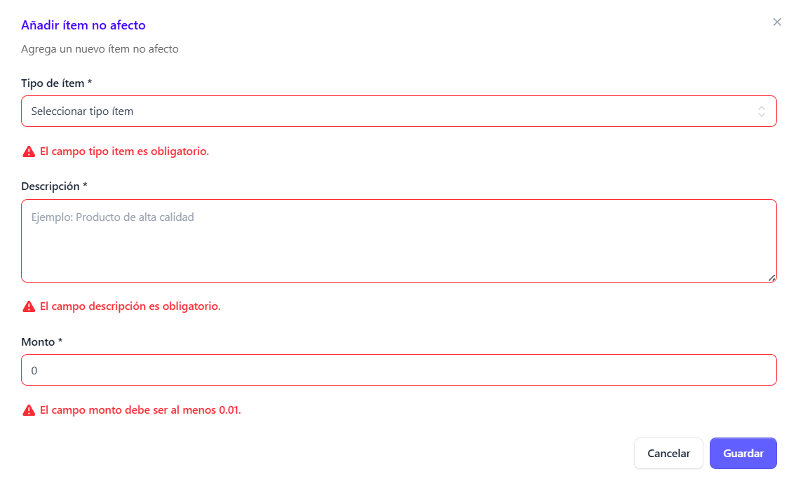
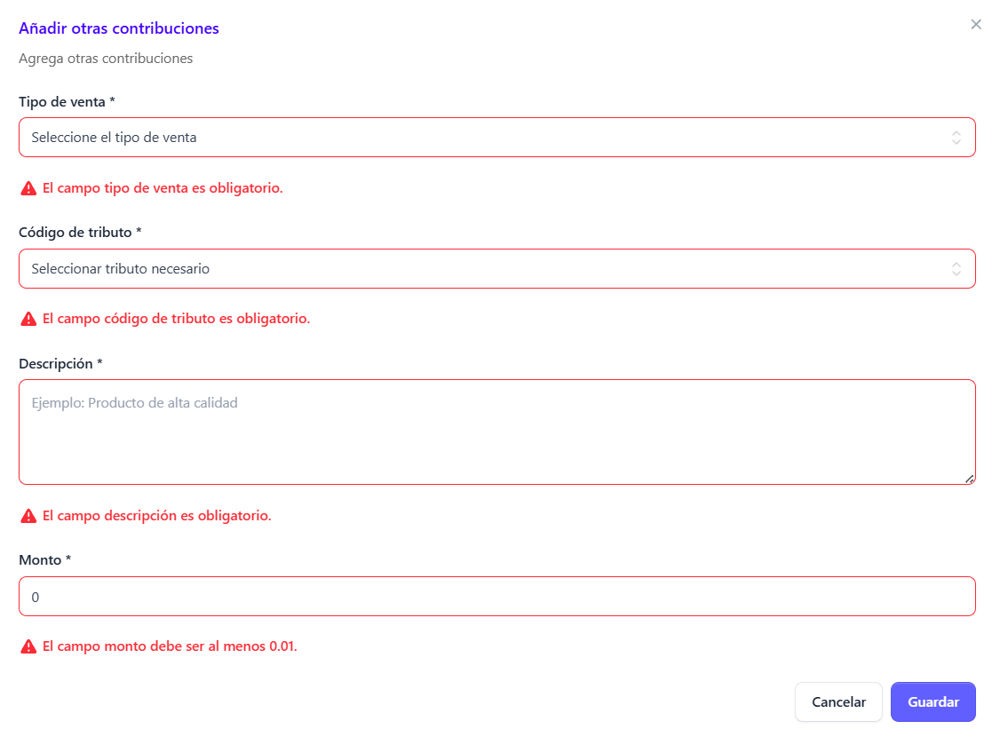

**Generación de facturas**

Para crear una nueva factura, dar clic en la sección facturas que se encuentra en el menú principal

 Al desplegarse la pantalla principal de **Facturas** haz clic en el botón “Nueva factura electrónica”

 Al seleccionarlo, se abrirá un modal en el que podrás elegir el tipo de factura que deseas generar de la lista disponible 

 

 ## Seleccción tipo de factura ##

Del modal desplegado, selecciona la opción **Factura** 

Luego haz clic en el botón **Continuar.**

## Llenado de  Formulario Factura electrónica ##

Automáticamente se  despliega el formulario de creación de factura

## Añadir cliente ##

Para la emisión de una factura electrónica, **el registro del cliente no siempre es obligatorio. Solo será requerido cuando el monto de la factura supere los veinticinco mil dólares,aplicable únicamente a este tipo de factura.** En los demás casos, el ingreso de los datos del cliente es obligatorio.

El formulario para añadir un cliente se despliega al hacer clic en el botón **“Añadir cliente”.**

Al hacer clic en el botón “Añadir cliente”, se despliega un formulario adicional. En este, **si el cliente ya existe, puede buscarse ingresando su número de documento de identidad.**
En caso de que no exista, es posible crear un nuevo registro desde cero, seleccionando el tipo de cliente correspondiente: Natural o Jurídico.

## Añadir cliente natural: ##

El cliente natural solicita los siguientes campos requeridos **(*)**

•	Nombre 

•	Tipo de documento (NIT, DUI, Pasaporte, Otro, Carnet de residente)

•	Número de documento

•	Dirección de correo electrónico 

**Nota aclaratoria: este es único para cada cliente, no puede usarse para registrar clientes diferentes con el mismo correo, cada cliente debe tener un correo diferente, si es personal o de uso comercial (empresa)**

•	Departamento

•	Municipio

•	Dirección

Mediante el siguiente formulario:

Al completar los campos clic en el botón **guardar** y se agrega de forma automática al modal 

## Añadir cliente jurídico: ##

El cliente jurídico solicita los siguientes campos requeridos **(*)**

•	Nombre

•	NRC

•	NIT

•	Teléfono

•	Nombre comercial 

•	Correo electrónico 

**Nota aclaratoria: este es único para cada cliente, no puede usarse para registrar clientes diferentes con el mismo correo, cada cliente debe tener un correo diferente, si es personal o de uso comercial (empresa)**

•	Actividad económica (seleccionar del catalogo que se despliega)

•	Departamento 

•	Municipio

•	Dirección 

Mediante el siguiente formulario:

Al completar los campos clic en el botón **guardar** y se agrega de forma automática al modal 

## Añadir productos ##

Para añadir un producto, haga clic en el botón **“Añadir producto”.**

A continuación, seleccione el tipo de producto que desea registrar entre las siguientes opciones:

- Producto o servicio

- Ítem no afecto

- Otro tipo de contribuciones

## Añadir bienes o sevicios ##

**Nota: La búsqueda de productos puede realizarse por descripción o código de producto:**

Para añadir un producto como bien o servicio, el sistema solicita completar los siguientes campos: 

**Los campos marcados con (*) son obligatorios.**

- Cantidad (*)

- Precio unitario (*)

- Tipo de venta (*): gravada, exenta o no sujeta

- Monto de descuento

- Total (*)

Al completar los campos requeridos debera dar clic en el botón **Guardar** y el producto sera añadido al modal

## Añadir ítems no afectos ##

En esta sección se deben completar únicamente los siguientes campos:

**Los campos marcados con (*) son obligatorios.**

- Tipo de ítem (*): Bienes

- Descripción (*)

- Monto (*)

Al completar los campos requeridos debera dar clic en el botón **Guardar** y el producto sera añadido al modal

## Añadir otras contribuciones ##

En esta sección se deben completar los siguientes campos obligatorios:

**Los campos marcados con (*) son obligatorios.**

- Tipo de venta (*): gravada, exenta o no sujeta

- Código del tributo (*)

- Descripción (*)

- Monto (*)

Al completar los campos requeridos debera dar clic en el botón **Guardar** y el producto sera añadido al modal

## Añadir información de pago ##

En esta sección se define la forma en que se llevará a cabo la transacción. Para ello, es necesario seleccionar la condición de operación, la cual puede ser:

- Contado

- Crédito

- Otro
