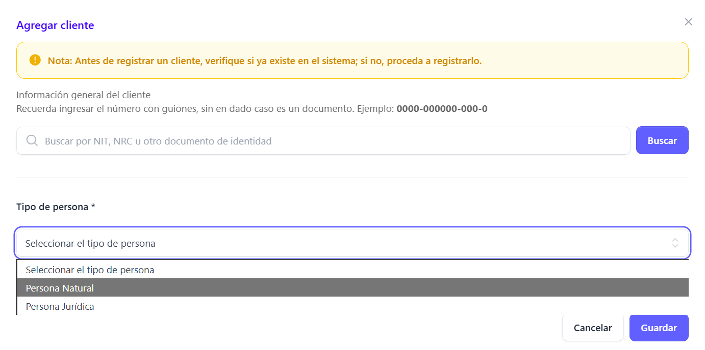
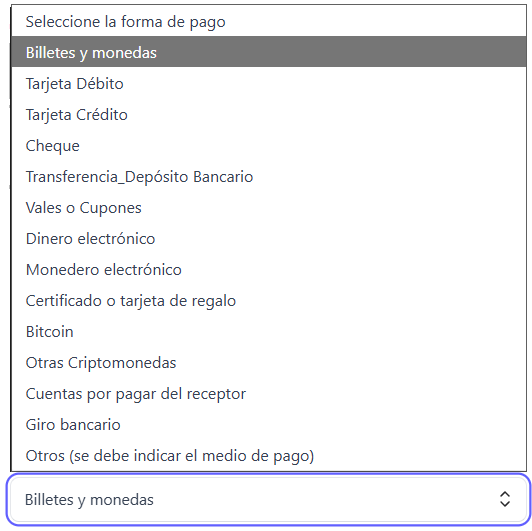
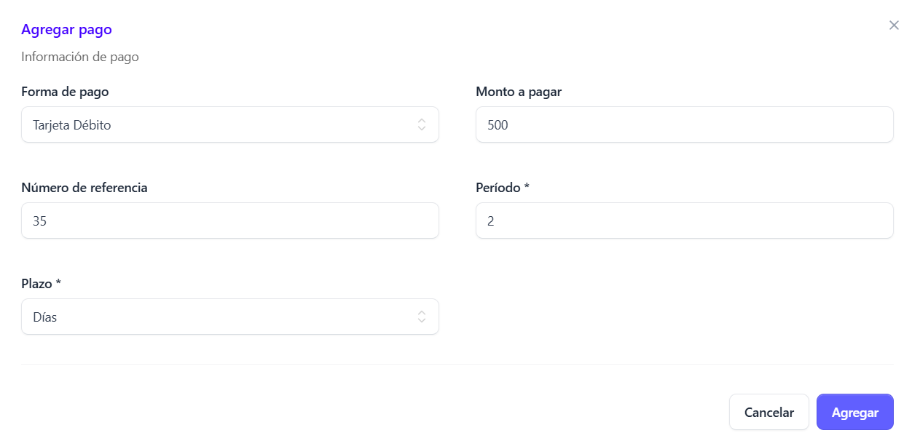
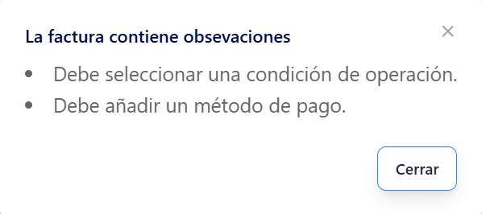

**Generación de facturas**

Para crear una nueva factura, dar clic en la sección facturas que se encuentra en el menú principal

 Al desplegarse la pantalla principal de **Facturas** haz clic en el botón “Nueva factura electrónica”

 Al seleccionarlo, se abrirá un modal en el que podrás elegir el tipo de factura que deseas generar de la lista disponible 

 

 ## Seleccción tipo de factura ##

Del modal desplegado, selecciona la opción **Comprobante de Crédito fiscal** 

Luego haz clic en el botón **Confirmar.**

## Llenado de  Formulario de Comprobante de Crédito fiscal ##

Automáticamente se  despliega el formulario de creación de factura

## Añadir cliente ##

Para la emisión de un comprobante de Crédito fiscal, el cliente es requerido

El formulario para añadir un cliente se despliega al hacer clic en el botón **“Añadir cliente”.**

Al hacer clic en el botón “Añadir cliente”, se despliega un formulario adicional. En este, **si el cliente ya existe, puede buscarse ingresando su número de documento de identidad,NRC u otro documento**
En caso de que no exista, es posible crear un nuevo registro desde cero, seleccionando el tipo de cliente correspondiente: Natural o Jurídico.

## Añadir Cliente Natural ##

Para registrar un cliente natural es necesario completar el siguiente formulario, que solicita los campos indicados (los marcados con * son obligatorios):

-	Nombre  (*)

-	Tipo de documento (NIT, por defecto) (*)

-	Número de documento (*)

-	NRC (*)

-	Dirección de correo electrónico (*)

**Nota aclaratoria: este es único para cada cliente, no puede usarse para registrar clientes diferentes con el mismo correo, cada cliente debe tener un correo diferente, si es personal o de uso comercial (empresa)**

-	Actividad económica (*)

-	Departamento (*)

-	Municipio (*)

-	Dirección (*)

## Añadir Cliente jurídico ##

El cliente jurídico solicita los siguientes campos requeridos (*)

-	Nombre (*)

-	NRC (*)

-	NIT (*)

-	Teléfono (*)

-	Nombre comercial (*)

-	Correo electrónico (*)

**Nota aclaratoria: este es único para cada cliente, no puede usarse para registrar clientes diferentes con el mismo correo, cada cliente debe tener un correo diferente, si es personal o de uso comercial (empresa)**

-	Actividad económica (*)

-	Departamento (*)

-	Municipio (*)

-	Dirección (*)

## Añadir productos ##

Para añadir un producto, haga clic en el botón **“Añadir producto”.**

A continuación, seleccione el tipo de producto que desea registrar entre las siguientes opciones:

- Producto o servicio

- Ítem no afecto

- Otro tipo de contribuciones

## Añadir productos o sevicios ##

**Nota: La búsqueda de productos puede realizarse por descripción o código de producto:**

Para añadir un producto como bien o servicio, el sistema solicita completar los siguientes campos: 

**Los campos marcados con (*) son obligatorios.**

•	Cantidad (*)

•	Precio unitario (*)

•	Tipo de venta (gravada, exenta, no sujeta) (*)

**Nota: El tributo el IVA se refleja únicamente si la venta es gravada**

•	Monto de descuento

•	Total (*)

Al completar los campos requeridos debera dar clic en el botón **Guardar** y el producto sera añadido al modal

## Añadir ítems no afectos ##

En esta sección se deben completar únicamente los siguientes campos:

**Los campos marcados con (*) son obligatorios.**

- Tipo de ítem (*): Bienes

- Descripción (*)

- Monto (*)

Al completar los campos requeridos debera dar clic en el botón **Guardar** y el producto sera añadido al modal

## Añadir otras contribuciones ##

En esta sección se deben completar los siguientes campos obligatorios:

**Los campos marcados con (*) son obligatorios.**

Se solicitan los siguientes campos obligatorios (*):

-	Tipo de venta (gravada, exenta, no sujeta) (*)

-	Código del tributo (*)

-	Descripción (*)

-	Monto (*)

Al completar los campos requeridos debera dar clic en el botón **Guardar** y el producto sera añadido al modal

## Añadir información de pago ##

En esta sección se define la forma en que se llevará a cabo la transacción. Para ello, es necesario seleccionar la condición de operación, la cual puede ser:

- Contado

- Crédito

- Otro

Posteriormente de haber realizado la selección de la Condicion de la operación, hay que **añadir un método de pago** desde el catálogo que se despliega. 

Luego dar clic en el botón **Guardar**

De forma inmediata se añade al modal de pago 

De no seleccionar una opción de las requeridas, muestra el siguiente modal indicando que se debe seleccionar un método de pago 

## Información adicional ##

Esta sección permite registrar especificaciones complementarias vinculadas al tipo de documento a emitir. Las opciones disponibles son:

- Extensión

- Venta a cuenta de terceros

- Otros documentos asociados

- Documentos relacionados

El llenado de esta sección deberá realizarse conforme al modelo de negocio correspondiente. En caso de que la información no aplique a las operaciones del usuario, no será necesario completarla.

## Extensión ##

Para añadir la extensión de un cliente, es necesario completar los siguientes campos obligatorios (*):

- Tipo de documento del receptor (*)

- Número de identificación del receptor (DUI, NIT, Pasaporte, Carnet de residente, Otro) (*)

**Nota: El número de documento debe ser veridico, de lo contrario el sistema le dira que es invalido**

- Nombre del receptor (*)

- Placa de vehículo (*)

Una vez completados los campos, haga clic en el botón **Agregar extensión**

## Venta a terceros ##

Si la generación del DTE no corresponde a una venta a cuenta de terceros, no será necesario completar esta sección. En caso contrario, cuando el DTE se emita a nombre de un tercero, deberán ingresarse los siguientes datos:

- NIT

- Nombre
 
 Una vez completados los campos, haga clic en el botón **Guardar** y sera añadido al modal

 

 ## Documentos asociados ##
Los documentos asociados son requeridos en los siguientes casos:

- Factura electrónica

- Comprobante de crédito fiscal

- Factura de exportación

Estos documentos pueden estar vinculados a:

- Emisor/Receptor

- Médico

## Emisor / Receptor: ##

Si se requiere asociar un documento que corresponde al Emisor o al Receptor se mostrará la siguiente pantalla al dar clic en el documento seleccionado

- Emisor

 

 - Receptor

  

  Al completar los campos dar clic en el botón **Agregar**

  ## Médico ##

  Cuando sea necesario asociar un documento que corresponda a un médico, al dar clic en el documento seleccionado se mostrará la pantalla correspondiente. **Esta opción aplica únicamente para el Comprobante de Crédito Fiscal y la Factura.**

Para completar el registro, el usuario deberá llenar los siguientes campos obligatorios (*) y opcionales:

- Documento asociado (*)

- Servicio realizado (*)

- Nombre del médico que prestó el servicio (*)

- Descripción del documento asociado

- Identificación del documento asociado

- NIT del médico que prestó el servicio (*)

Una vez ingresada la información requerida, **haga clic en el botón Agregar para guardar el documento asociado.**

## Añadir documento relacionado / Fisico ##

Los documentos relacionados permiten asociar comprobantes adicionales que sirven como respaldo de la transacción. Estos pueden gestionarse en formato físico o digital, según el caso, y son indispensables para garantizar la trazabilidad contable y legal.

Dar clic en el botón añadir documento/ doocumento fisico 

Se despliega la siguiente pantalla:

Entre los principales documentos se  se encuentran:

Para añadir este tipo de documentos se deben completar los campos obligatorios (*):

- Tipo de documento:(*)

**Nota de remisión:** respalda la entrega o traslado de bienes vinculados a la factura.

**Comprobante de liquidación:** acredita la liquidación de una operación específica relacionada con la factura emitida.

**Documento contable de liquidación:** registra de manera formal y contable la liquidación, asegurando la coherencia entre la operación y los asientos contables correspondientes.

- Número de documento (*)

- Fecha de generación (*)

Luego de completar los campos requeridos, dar clic en el botón **Agregar**

Se añadira al modal de forma inmediata:

**Nota: Antes de añadir un producto, registre el documento relacionado correspondiente. En caso de ingresar el producto primero, este será eliminado, conforme a la advertencia que se muestra a continuación.**

Ya que al añadir un documento relacionado, en el formulario de añadir producto se habilita el campo **Número de documento** 

Al finalizar el llenado de los campos, **haga clic en el botón Guardar factura.**

  

 De esta manera, la factura se generará correctamente y quedará lista para el proceso de sellado por parte del Ministerio de Hacienda.

