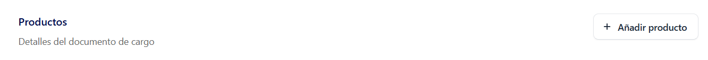
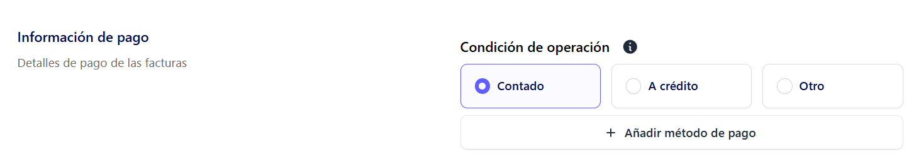
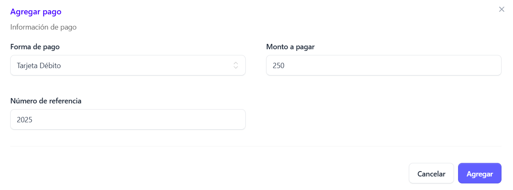

Para crear una nueva factura, dar clic en la sección facturas que se encuentra en el menú principal

 Al desplegarse la pantalla principal de **Facturas** haz clic en el botón “Nueva factura electrónica”

 Al seleccionarlo, se abrirá un modal en el que podrás elegir el tipo de factura que deseas generar de la lista disponible 

 

## Seleccción tipo de factura ##

Del modal desplegado, selecciona la opción **Facturas de exportación**

 

 Luego haz clic en el botón **Confirmar.**

## Llenado de  Formulario Factura de Exportación ##

Automáticamente se  despliega el formulario de creación de factura

## Añadir cliente ##

Para la emisión de una factura electrónica de exportación, el cliente es requerido de forma obligatoria y este debe ser de carácter extranjero

El formulario para añadir un cliente se despliega al hacer clic en el botón **“Añadir cliente”.**

Al hacer clic en el botón “Añadir cliente”, se despliega un formulario adicional. En este, **si el cliente ya existe, puede buscarse ingresando su número de documento de identidad,NRC u otro documento**
En caso de que no exista, es posible crear un nuevo registro desde cero, seleccionando el tipo de cliente correspondiente: Natural o Jurídico.

## Añadir Cliente Natural ##

Para registrar un cliente natural es necesario completar el siguiente formulario, que solicita los campos indicados (los marcados con * son obligatorios):

- Nombre (*)

- Tipo de documento (*): Pasaporte, Otro, Carnet de residente.

- Nombre comercial (opcional).

- Número de documento (*)

- Correo electrónico (*)

**Nota: el correo electrónico es único para cada cliente. No se permite registrar clientes diferentes con el mismo correo, independientemente de si es de uso personal o comercial.**

- Dirección (*)

- Actividad económica (*)

- País (*)

## Añadir cliente jurídico ##

El cliente jurídico solicita los siguientes campos requeridos (*)

-	 Nombre (*)

-	Tipo de documento (Pasaporte, Otro, Carnet de residente) (*)

-	Nombre comercial 

-	Número de documento (*)

-	Dirección de correo electrónico (*)

**Nota aclaratoria: este es único para cada cliente, no puede usarse para registrar clientes diferentes con el mismo correo, cada cliente debe tener un correo diferente, si es personal o de uso comercial (empresa)**

-	Dirección (*)

-	Actividad económica (*)

-	Pais (*)

-	Dirección (*)

Al completar los campos dar clic en el botón **Guardar**

## Flete y seguro ##

Estos terminos se utilizan en la factura de exportación para detallar costos asociados al transporte y protección de la mercadería durante su envío, **estos campos son opcionales**

## Añadir productos ##

Para añadir un producto, haga clic en el botón **“Añadir producto”.**

Selecciona Producto o servicio

## Añadir productos o sevicios ##

**Nota: La búsqueda de productos puede realizarse por descripción o código de producto:**

Para añadir un producto como bien o servicio, el sistema solicita completar los siguientes campos: 

**Los campos marcados con (*) son obligatorios.**

-	Cantidad (*)

-	Precio unitario (*)

-	Tipo de venta (gravada, exenta, no sujeta) (*)

-	Monto de descuento

-	Tributo (*)

-	Total (*)

Al dar clic en el botón Guardar el producto sera añadido

## Añadir información de pago ##

En esta sección se define la forma en que se llevará a cabo la transacción. Para ello, es necesario seleccionar la condición de operación, la cual puede ser:

- Contado

- Crédito

- Otro

Posteriormente de haber realizado la selección de la Condicion de la operación, hay que **añadir un método de pago** desde el catálogo que se despliega. 

Luego dar clic en el botón **Agregar**

De forma inmediata se añade al modal de pago 

## Añadir información adicional ##

En esta sección se pueden registrar especificaciones especiales relacionadas con el tipo de documento a emitir. Las opciones disponibles son:

- Venta a cuenta de terceros

- Otros documentos asociados (transporte)

El llenado de esta información dependerá del modelo de negocio en el que se esté trabajando. En caso de que no sea requerida para la operación, esta sección deberá dejarse sin completar.

## Venta a terceros ##

Si la generación del DTE no requiere venta a cuenta de terceros no será necesario completar esta información. Cuando el DTE a generar corresponda a una venta a cuenta de terceros se completará la siguiente información:

- 	NIT

-	Nombre

 Una vez completados los campos, haga clic en el botón **Guardar** y sera añadido al modal

## Documentos asociados (Transporte) ##

Para completar esta sección, es necesario ingresar la siguiente información:

- Documento asociado (*)

- Identificación del documento asociado

- Placa del vehículo (*)

- Tipo de documento (NIT, DUI, Pasaporte, Otro, Carnet de residente) (*)

- Nombre completo del conductor (*)

- Número de identificación del conductor

- Modo de transporte: terrestre, marítimo, aéreo, multimodal-terrestre, multimodal-marítimo-aéreo, multimodal-terrestre-marítimo-aéreo (*)

Una vez ingresada la información requerida, **haga clic en el botón Agregar para guardar el documento asociado.**

 Se añadira al modal 

 

Al finalizar el llenado de los campos, **haga clic en el botón Guardar factura.**

 De esta manera, la factura se generará correctamente y quedará lista para el proceso de sellado por parte del Ministerio de Hacienda.
