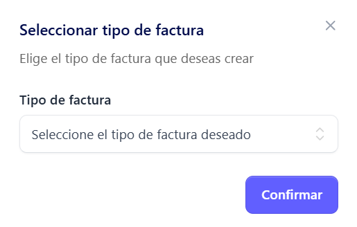
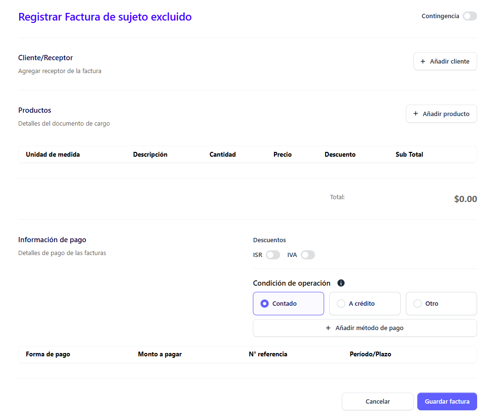
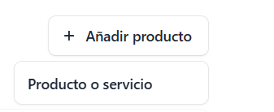

**Generación de facturas**

Para crear una nueva factura, dar clic en la sección facturas que se encuentra en el menú principal

 Al desplegarse la pantalla principal de **Facturas** haz clic en el botón “Nueva factura electrónica”

 Al seleccionarlo, se abrirá un modal en el que podrás elegir el tipo de factura que deseas generar de la lista disponible 

 

 ## Seleccción tipo de factura ##

Del modal desplegado, selecciona la opción **Factura de sujeto excluido**

 

 Luego haz clic en el botón **Confirmar.**

## Llenado de  Formulario Factura de Sujeto excluido ##

Automáticamente se  despliega el formulario de creación de factura

## Añadir cliente ##

Para la emisión de una factura electrónica de sujeto excluido, el cliente es requerido

Dar clic en el botón **Añadir cliente**

 

 Se despliega el siguiente modal de búsqueda, para verificar si el cliente ya a sido registrado 

 

Si ya existe un cliente previamente registrado, se puede realizar búsqueda mediante los siguientes parametros:

- Nombre o coincidencia 
- Número de NIT
- Número de NRC
- Número de cualquier otro documento

Si existe el registro previo de un cliente, se muestra el resultado de la siguiente manera:

 

Se selecciona el cliente, y se muestra el siguiente formulario con la información del registro

 

En caso de que no exista el registro se muestra el siguiente mensaje

 

 Donde aqui se habilita la opción crear un nuevo registro desde cero, dando clic en el botón 

 

 Donde se seleccionando el tipo de cliente correspondiente: Natural o Jurídico.

## Añadir Cliente Natural ##

Para registrar un cliente natural es necesario completar el siguiente formulario, que solicita los campos indicados (los marcados con * son obligatorios):

El cliente natural solicita los siguientes campos requeridos (*)

-	Nombre (*)

-	Tipo de documento (NIT, DUI, Pasaporte, Otro, Carnet de residente) (*)

-	Dirección de correo electrónico (*)

**Nota aclaratoria: este es único para cada cliente, no puede usarse para registrar clientes diferentes con el mismo correo, cada cliente debe tener un correo diferente, si es personal o de uso comercial (empresa)**

-	Departamento (*)

-	Municipio (*)

-	Dirección (*)

## Añadir cliente jurídico ##

El cliente jurídico solicita los siguientes campos requeridos (*)

-	Nombre (*)

-	NRC (*)

-	NIT (*)

-	Teléfono (*)

-	Nombre comercial (*)

-	Correo electrónico (*)

**Nota aclaratoria: este es único para cada cliente, no puede usarse para registrar clientes diferentes con el mismo correo, cada cliente debe tener un correo diferente, si es personal o de uso comercial (empresa)**

-	Actividad económica (*)

-	Departamento (*)

-	Municipio (*)

-	Dirección (*)

## Añadir productos ##

Para añadir un producto, haga clic en el botón **“Añadir producto”.**

Selecciona Producto o servicio

## Añadir productos o sevicios ##

Al dar clic en el botón se despliega el siguiente formulario donde se pueden ejecutar las siguientes acciones:

### Añadir productos previamante registrados ###

**Nota: La búsqueda de productos puede realizarse por descripción o código de producto:**

Para añadir un producto como bien o servicio, el sistema solicita completar los siguientes campos: 

**Los campos marcados con (*) son obligatorios.**

-	Cantidad (*)

-	Precio unitario (*)

-	Tipo de venta (gravada, exenta, no sujeta) (*)

-	Monto de descuento

-	Total (*)

Al completar los campos dar clic en el botón **Añadir**

### Añadir producto de forma directa al modal, sin previo registro ###

Al dar clic en el botón **Añadir producto**, en el modal que se despliega , en la parte superior derecha se muestra el botón **Agregar nuevo producto**

**Nota aclaratoria: Los productos añadidos desde esta sección no se guardarán en la lista general de productos, ya que son registrados únicamente para uso puntual dentro de la operación actual.**

 
 Se despliega el formulario para añadir producto

 

 Donde al igual que con el formulario de productos previamente registrados hay que completar los siguientes campos obligatorios: 

- Producto (Nombre del producto o descripción)

- Tipo de ítem (Bienes, servicios, ambos)

- Código del producto

- Unidad de medida (seleccionarla del católogo)

-	Cantidad (*)

-	Precio unitario (*)

-	Tipo de venta (gravada, exenta, no sujeta) (*)

-	Monto de descuento

-	Total (*)

Al completar los campos dar clic en el botón **Añadir** 

 

 el producto sera añadido al modal para continuar con el siguiente paso

## Añadir información de pago ##

En esta sección se define la forma en que se llevará a cabo la transacción. Para ello, es necesario seleccionar la condición de operación, la cual puede ser:

- Contado

- Crédito

- Otro

## Descuentos Impuesto del Valor Agregado (IVA) e Impuesto Sobre la Renta (ISR)

Aquí se incluyen dos Switch para añadirle Impuesto sobre la renta o Impuesto de valor agregado (IVA)

Al activar los switches automáticamente los descuentos se ven reflejados en el total a pagar

## Añadir pago ##

Posteriormente de haber realizado la selección de la Condicion de la operación, hay que **añadir un método de pago** desde el catálogo que se despliega. 

Luego dar clic en el botón **Agregar**

De forma inmediata se añade al modal de pago 

De no seleccionar una opción de las requeridas, muestra el siguiente modal indicando que se debe seleccionar un método de pago 

Al finalizar el llenado de los campos, **haga clic en el botón Guardar factura.**

 De esta manera, la factura se generará correctamente y quedará lista para el proceso de sellado por parte del Ministerio de Hacienda.

