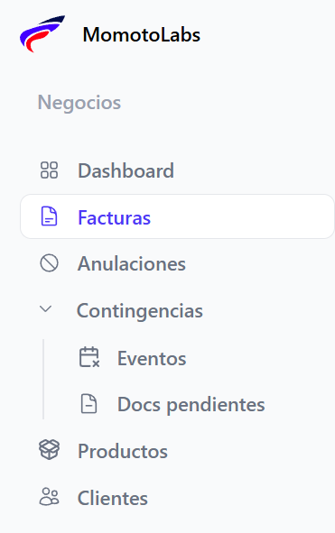

**Generación de facturas**

Para crear una nueva factura, dar clic en la sección facturas que se encuentra en el menú principal

 Al desplegarse la pantalla principal de **Facturas** haz clic en el botón “Nueva factura electrónica”

 Al seleccionarlo, se abrirá un modal en el que podrás elegir el tipo de factura que deseas generar de la lista disponible 

 

 

