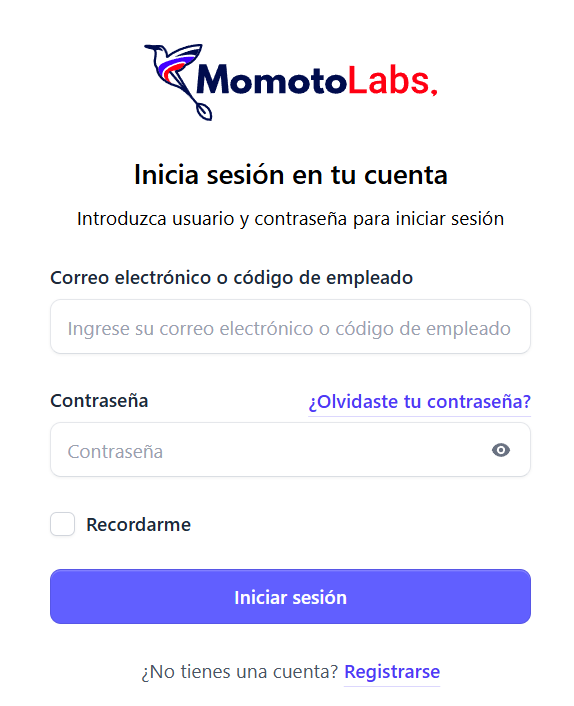
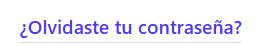
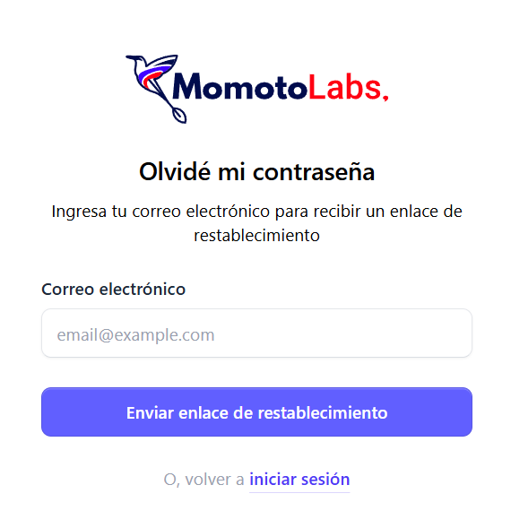
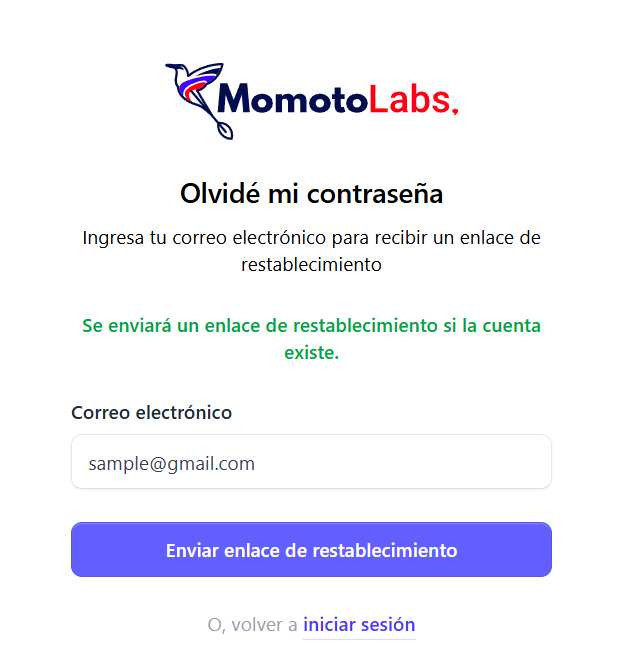
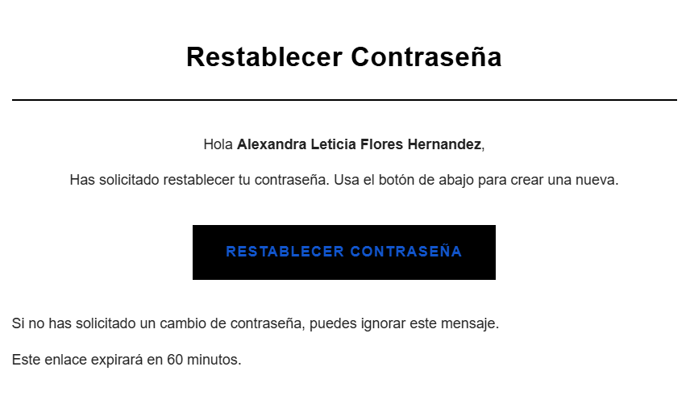
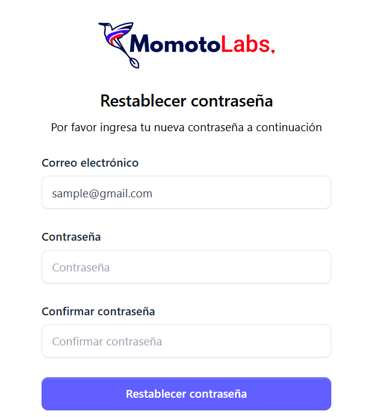
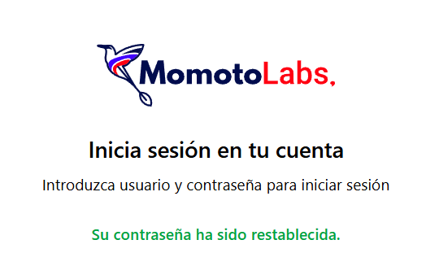

Al ingresar a la URL: https://biller.momotolabs.com
 se mostrará la pantalla de inicio de sesión, donde podrá identificar y completar los campos necesarios para acceder al sistema

 

- **Correo electrónico o código de empleado:** casilla para ingresar el correo registrado o el código asignado (si ya posee).

- **Contraseña:** espacio para escribir la clave de acceso del usuario.

- **Recordarme:** casilla opcional que permite mantener la sesión activa incluso si el navegador se cierra de forma repentina.

- **Botón Iniciar sesión:** al completar los campos de correo o código de empleado y la contraseña, haga clic en este botón para ingresar al sistema.

### Restablecer contraseña ###

- Olvidaste tu contraseña: si el usuario no recuerda su clave de acceso, puede dar clic en este enlace para abrir la pantalla de recuperación 

En el formulario debe ingresar su **dirección de correo electrónico registrada.**

Luego, hacer clic en el botón **Enviar enlace de restablecimiento.**

  

El sistema mostrará un mensaje confirmando que, si la cuenta existe, recibirá un correo con las instrucciones para restablecer la contraseña.

Luego de solicitar el cambio de contraseña, el sistema enviará un mensaje a la bandeja de entrada del correo registrado. Dentro del contenido del correo, deberá hacer clic en el botón Restablecer contraseña para continuar con el proceso.

Al hacer clic en el botón Restablecer contraseña, el sistema redirige al formulario de cambio de contraseña. En esta pantalla se solicita ingresar el correo del usuario, la nueva contraseña y la confirmación de la misma para completar el proceso.

Al completar los campos solicitados, haga clic en el botón **Restablecer contraseña** Posteriormente, el sistema mostrará un mensaje de confirmación indicando que la contraseña ha sido restablecida correctamente.

Luego de visualizar el mensaje de confirmación, diríjase a la pantalla de inicio de sesión (login) para ingresar con su nueva contraseña.

