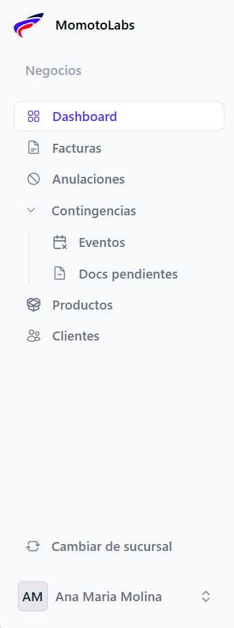
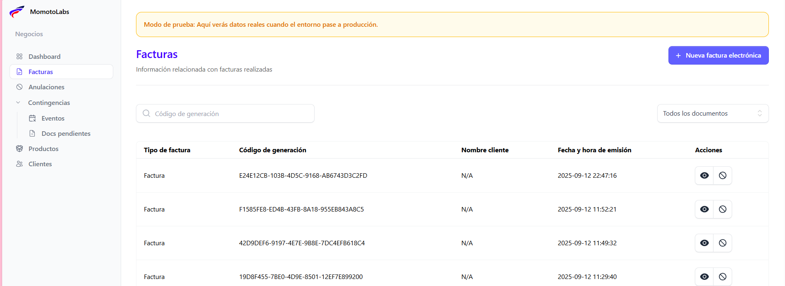
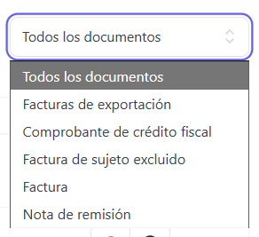
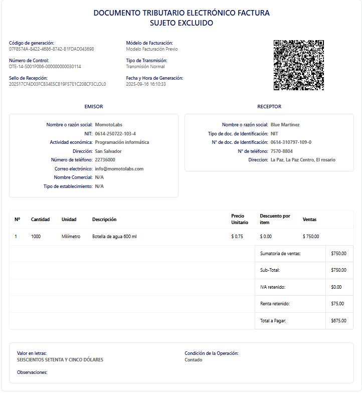
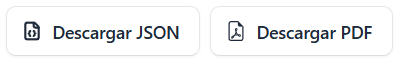
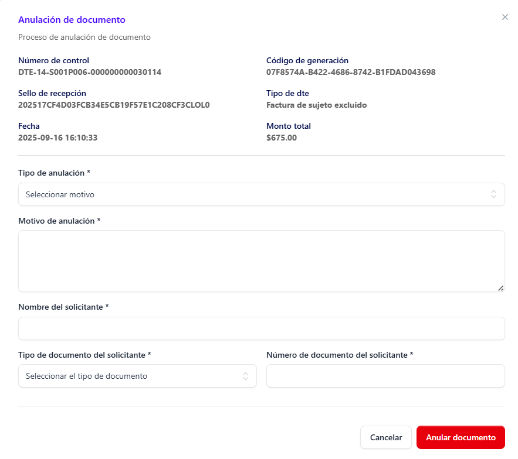

En el menú principal se encuentran las funciones necesarias para el uso y administración del facturador. Desde este apartado, el usuario puede acceder de manera organizada a los diferentes módulos que garantizan el correcto funcionamiento del sistema.

## Facturas ##

En la sección de Facturas se despliega un modal con el listado de los documentos generados en el sistema. Este listado incluye la siguiente información: tipo de factura, código de generación, nombre del cliente, fecha y hora de emisión, así como las acciones disponibles para cada registro.

Dentro del listado de facturas, el sistema permite realizar búsquedas específicas utilizando el código de generación. Además, se cuenta con un filtro por tipo de documento para facilitar la localización de facturas según sus características.

**Búsqueda por código de generación:** 
Dentro de esta casilla se puede realizar la búsqueda de una factura especifica mediante el código de generación que proporciona el Ministerio de Hacienda.

**Filtro por tipos de facturas:**

Se pueden realizar filtros por tipos o grupos de facturas especificas mediante su tipo de factura, se pueden filtrar por: 

- Todos los documentos 
- Facturas de exportación
- Comprobante de crédito fiscal 
- Factura de sujeto excluido
- Factura
- Nota de remisión

**Acciones** 

Dentro de la vista general de facturas, el usuario dispone de **tres acciones principales,** identificadas mediante íconos:

- Ver documento: muestra la vista previa de la factura.

- Anular documento: permite cancelar una factura emitida.

- Reenviar correo: envía nuevamente la factura al correo electrónico del cliente.

**Vista previa el documento:**

 Muestra todos los detalles de la factura según su tipo (Print de la factura) y se representa por el siguiente icono y dentro de esta vista se poseen dos botones para descargar el PDF de la factura generada y el archivo JSON de la misma

**Print de la factura:**

Al hacer clic en este ícono, se genera automáticamente la visualización de la factura en formato de impresión, de acuerdo con el tipo de factura correspondiente.

 

**Botones de descarga de documentos:**

En la parte superior derecha del print de la factura se encuentran los botones de descarga. Al hacer clic en cualquiera de ellos, se ejecuta automáticamente la acción de descarga del documento.

 

**Anular documento:**

La anulación de un documento puede realizarse por diferentes motivos. Es importante destacar que este proceso no elimina el documento del sistema, sino que lo marca como no válido para efectos fiscales.
Para anular una factura, haga clic en el ícono “Anular documento”. 

 

Al hacerlo, se desplegará un formulario que deberá completarse para finalizar el proceso.

 

**Reenvío de correo:**

En caso de que el cliente solicite nuevamente el envío de la factura al correo electrónico registrado, el sistema permite un único intento de reenvío. Una vez realizada la acción, la factura llegará a la bandeja de entrada del cliente.
Esta función está representada por el ícono correspondiente y, si el reintento ya fue utilizado, la opción dejará de estar disponible.

**Nota:** Si el correo ya fue reenviado, el ícono correspondiente desaparecerá de la sección de acciones.

