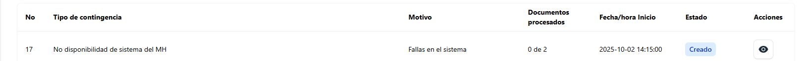
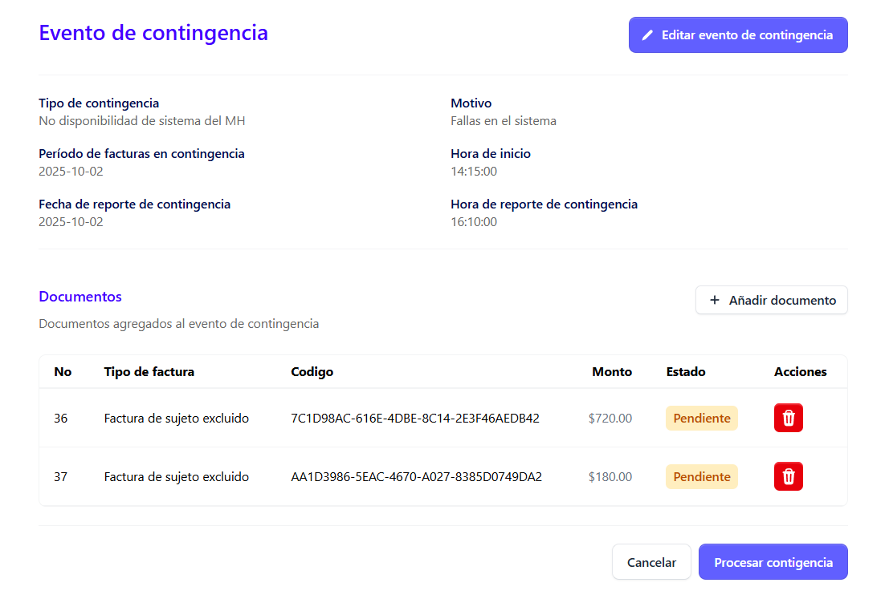
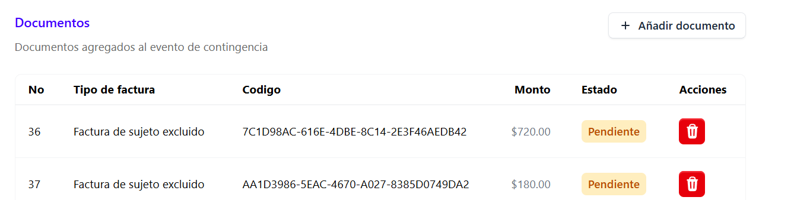
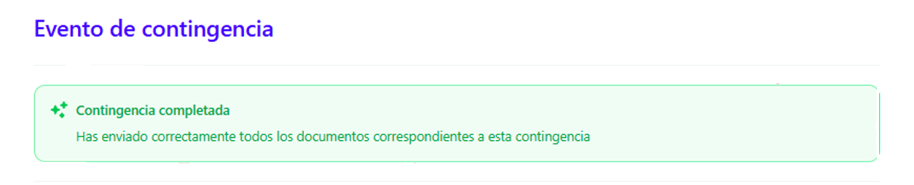
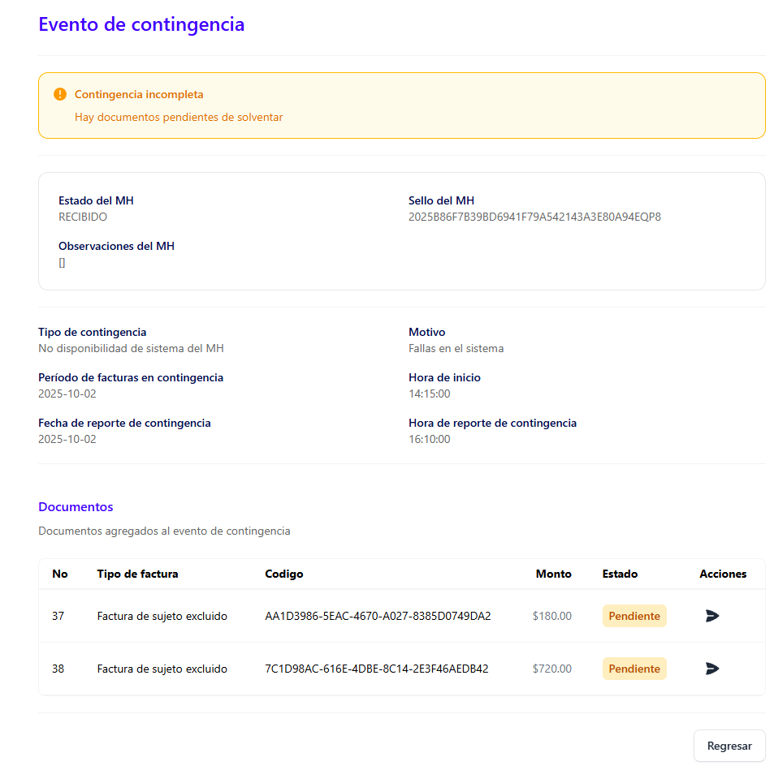
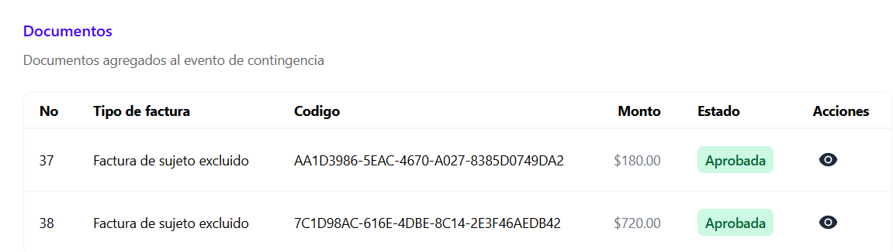
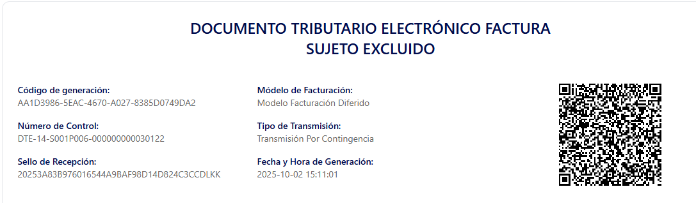
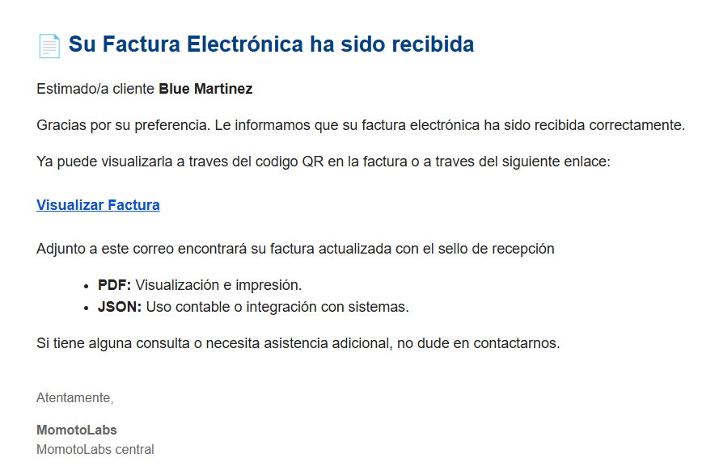
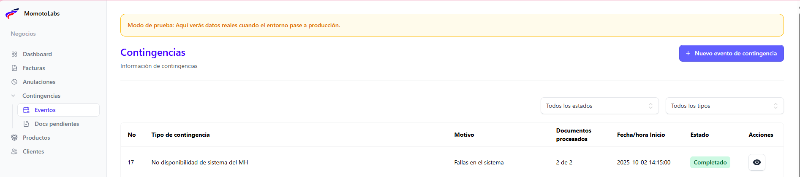
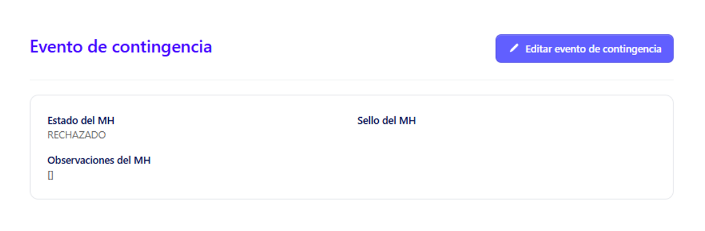

Para procesar un evento de contingencia, el usuario debe contar con los permisos correspondientes que le permitan ejecutar esta acción.

Posiconarse en el evento a procesar 

 Dar clic en el icono **Detalles** que se encuentra en las acciones.

Se muestra automáticamente los detalles de este evento de contingencia

### Detalles del evento de contingencia ###

En este evento se detallan los siguientes campos:

- Tipo de contingencia 
- Motivo 
- Peridodo de facturas en contingencia 
- Hora de inicio 
- Fecha de reporte de contingencia 
- Hora de reporte de contingencia 

**Nota: Si hubiese un documento pendiente de añadir, esto puede realizarse dando clic en el siguiente botón:**

Se listan los documentos a procesar:

Se describen por:

- Tipo de factura 
- Código de factura 
- Monto 
- Estado
- Acción eliminar 

Al verificar que todos los detalles mostrados don correctos, dar clic en el botón **Procesar contingencia**

Si la contingencia fue aprobada se mostrara el siguiente mensaje

Pero si la contingencia no se procesa de manera automática y aún hay documentos por procesar se muestra el siguiente mensaje 

### Procesar contingencia pendiente ###

Para poder **enviar la contingencia** dar clic en el siguiente icono en acciones :

El documento será enviado y se mostrará un mensaje de confirmación indicando que la contingencia se ha completado correctamente.

y se visualiza en cambio de estatus en los documentos a **Aprobada**

De forma inmediata el documento se sella por parte del Ministerio de Hacienda

### Correo de notificación de recepción de la factura ###

El cliente recibe tambien en su correo la notificación que el documento fue recibido y esta listo para su verificación

En el listado de eventos se muestra con estado **Completado** 

### Contingencia rechazada ###

Pero si el Ministerio de Hacienda **no acepta** la solicitud, este devuelve el estatus **Rechazado y sin sello**

