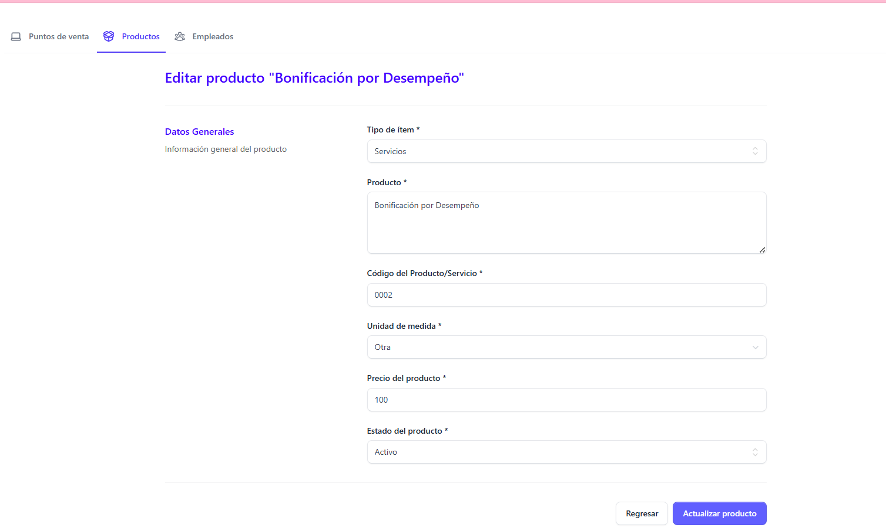
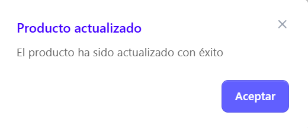

Para editar un producto, basta con posicionarse en el producto al que el usuario desea aplicar cambios y dar clic en el botón editar, y automáticamente de despliega el formulario de edición, donde se pueden modificar los siguientes campos:

- Tipo de item (Bienes/Servicios/Ambos)
- Producto (Nombre del producto)
- Código del Producto/Servicio
- Unidad de medida (Seleccionarla del católogo)
- Precio del producto
- Estado del producto (Activo/Inactivo)

Al finalizar con los cambios a aplicar, dar clic en el botón Actualizar producto

Automáticamente se despliega un mensaje indicando que el producto a sido actualizado correctamente 

