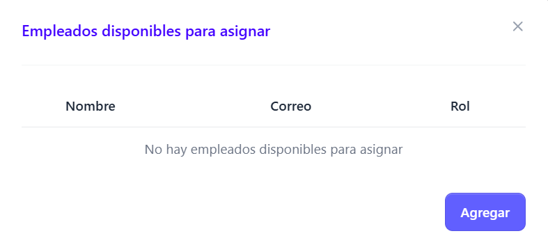

Para realizar la asignación de un empleado a una sucursal, hay que posicionarse en el menú lateral inzquierdo que aparece en la pantalla, y dar clic a la sección Sucursales, posteriormente dar clic en la sección Detalles. 
Dentro de Detalles buscar el apartado de empleados

posteriormente dar clic en el botón agregrar empleado 

Automáticamente si hay empleados para asignar se mostraran en el listado que se carga en el formulario de asignación

Dar clic en la checkbox del empleado que aparece disponible para asignar, y posterior a eso dar clic en el botón agregar. Aparecera un mensaje que indica que el empleado se agrego correctamente

 Si no hay empleados disponibles, aparecera el mensaje que no hay empleados por asignar 

## Desasignar empleado de una sucursal

Para desasignar un empleado de una sucursal, basta con ingresar a Sucursales. Detalles, Empleados, posicionarse en el nombre del empleado a desasignar y dar clic en los tres puntitos que aparecen en la sección de acciones de la tabla de empleados 

Dar clic en el boton Desasignar de sucursal

Posteriormente de haber dado clic en desasignar sucursal, se muestra un mensaje que indica que el empleado se desasigno correctamente

