Para acceder a las configuraciones del negocio, posicionarse en la sección **Configuraciones** que se encuentra en el menú principal.

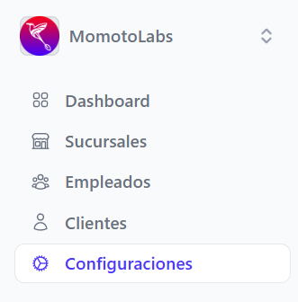

Se despliega la pantalla que contiene:

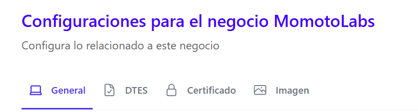

- Configuraciones generales del negocio
- Configuraciones de DTES
- Configuraciones de Certificado del negocio 
- Configuraciones Imagen

## Configuraciones generales del negocio ##

Al ingresar a la sección **Generales** de las configuraciones se pueden visualizar:

**Datos generales** 

Información general del negocio

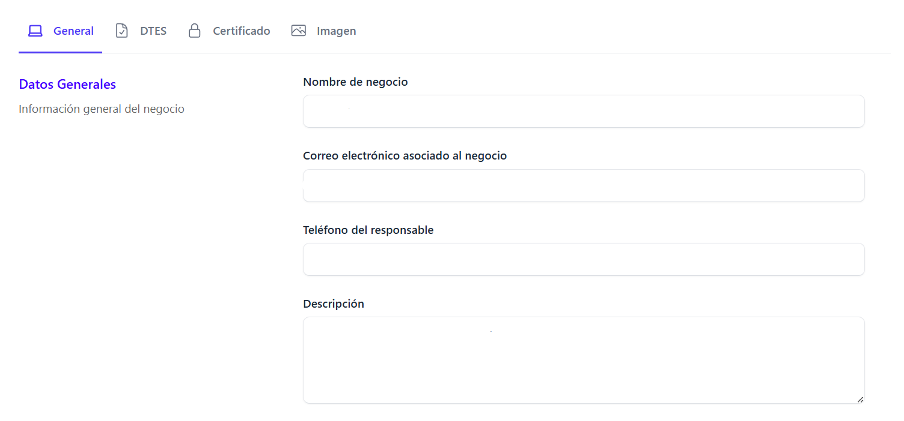

- Nombre del negocio 
- Correo electrónico asociado al negocio
- Teléfono del responsable 
- Descripción del negocio 

**Datos comerciales**

Información necesaria para la facturación

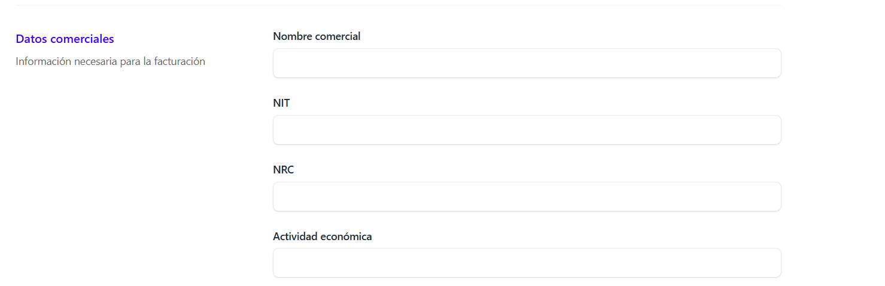

- Nombre comercial
- Número de NIT
- Número de NRC 
- Actividad economica (seleccionar del catalogo que se despliega)

Para poder realizar edición de datos **Generales del negocio y datos del Certificado** ir al pie de página y dar clic en el botón **Ir a editar negocio**

Se redireccionara a la sección **Negocios** 

## Configuraciones de DTES ##

Al ingresar a la sección **DTES** se pueden activar o desactivar los switches de los documentos que se habilitaran/ deshabilitaran para realizar la facturación 

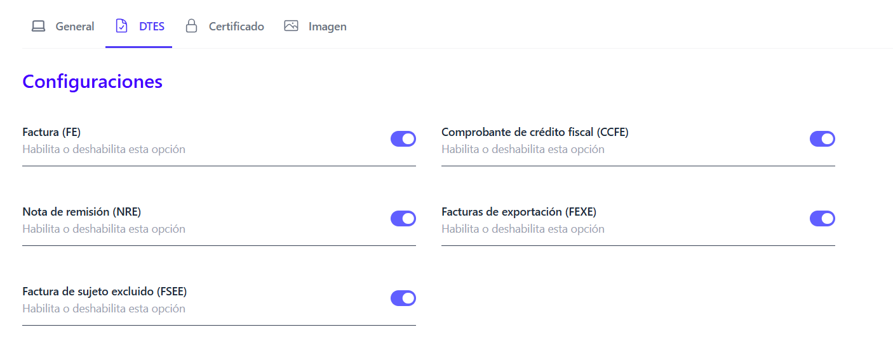

## Configuraciones del Certificado del negocio ##

Al ingresar a la sección **Certificado** se puede hacer la carga de un nuevo certificado, ingresar la **Clave del certificado** y la **Contraseña de la API del MH** 

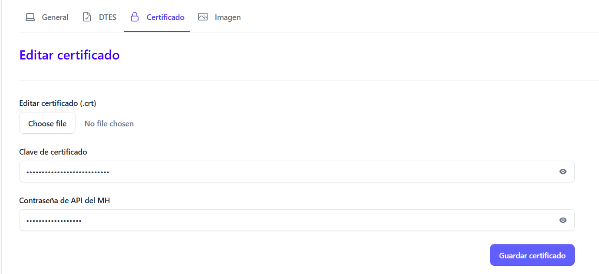

al realizar estos cambios dar clic en el botón **Guardar certificado**

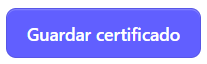

## Configuraciones de Imagen del negocio ##

Al ingresar a la sección **Imagen** se puede realizar la carga de la primer imagen del negocio o actualizar la imagen existente.

Se muestra la siguiente pantalla:

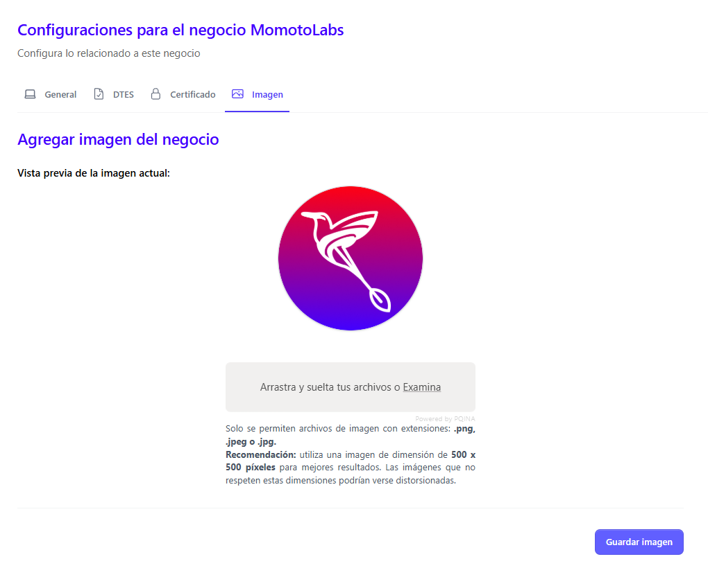

Para cargar una nueva imagen dar clic en la sección **Arrastra y suelta tus archivos o Examina**

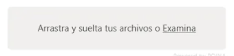

se despliega la pantalla para poder hacer selección y la carga de la imagen 

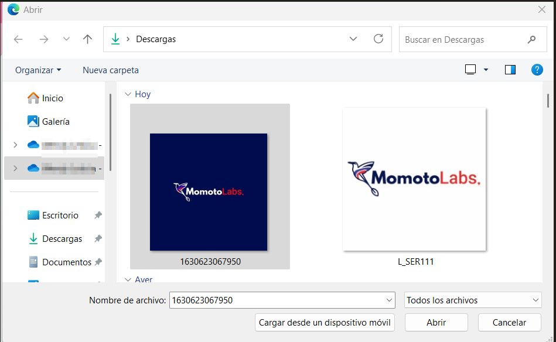

Dar clic en el botón abrir, la nueva imagen se carga justo abajo de la anterior 

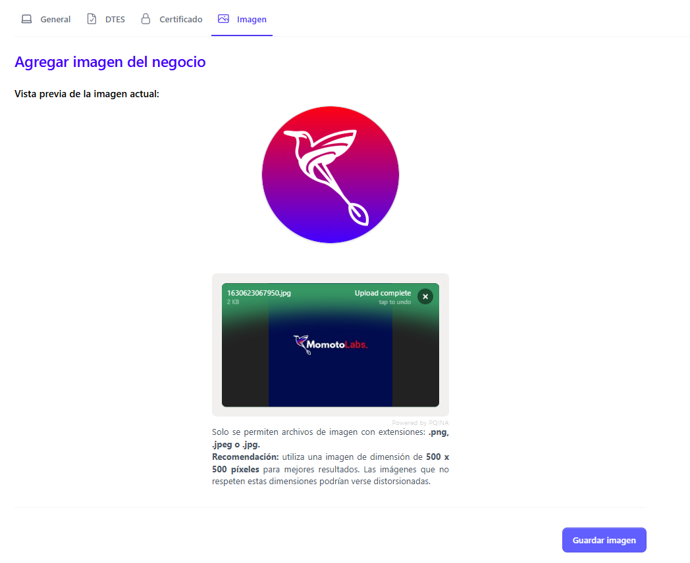

**Recuerda seguir las especificaciones de formato y tamaño de imagen permitidas**

Una vez cargada la imagen dar clic en el botón guardar imagen 

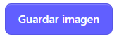

Automáticamente se muestra el mensaje que indica que la imagen fue cargada exitosamente

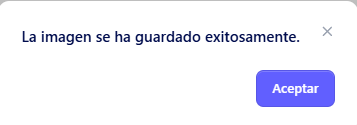

