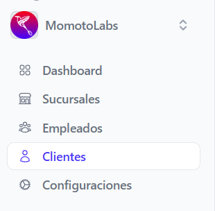
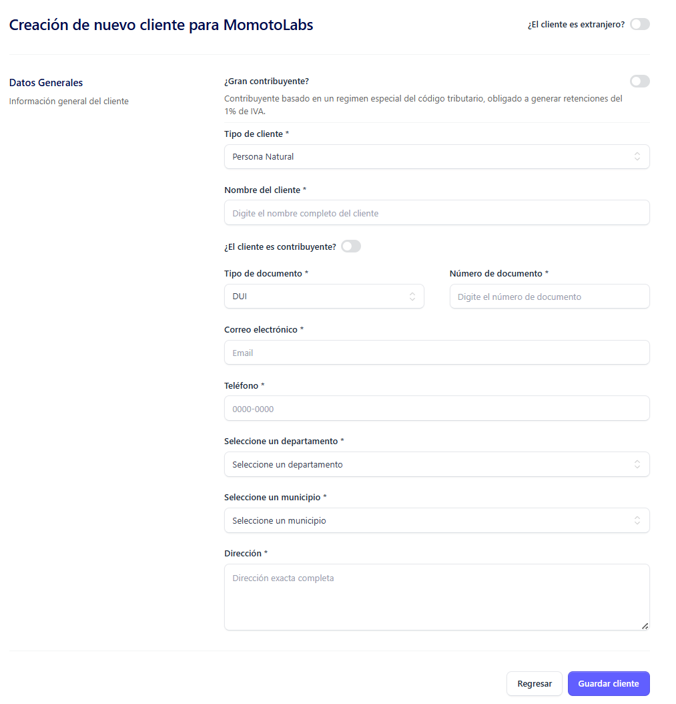
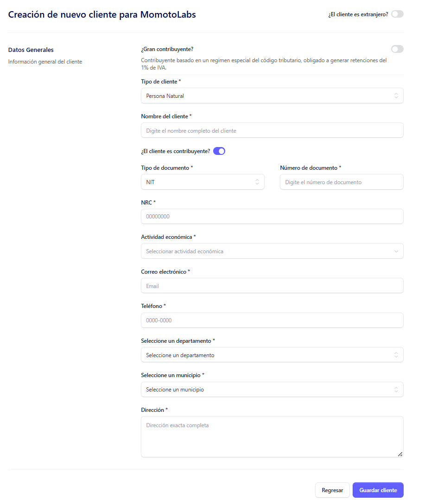
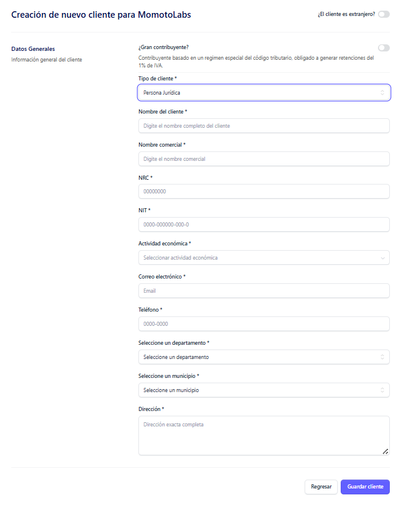

Para crear un cliente, hay que posicionarse en el menú lateral izquierdo, dar clic en la opcion Clientes 

Donde al dar clic automáticamente se despleiga la siguiente pantalla:

Buscar el boton **Nuevo Cliente** que se encuentra posicionado en el lado superior derecho de la pantalla 

Al dar clic se muestra la siguiente pantalla con el formulario a completar: 

**Los campos del formulario pueden ser diferentes según el tipo de cliente seleccionado**

## Cliente Natural ##

Para poder crear un cliente de indole **Natural** se deben completar los siguientes campos:

**Datos Generales**

¿El cliente es extranjero?
Para este tipo de cliente (Persona Natural), el switch debe permanecer desactivado.

- **Tipo de cliente**
El sistema muestra automáticamente "Persona Natural"; debe dejarlo así como aparece.

- **Nombre del cliente** 

Ingresar el nombre completo del cliente.

- **¿El cliente es contribuyente?**

Mantener este switch desactivado para persona natural.

- **Tipo de documento**

Seleccionar el tipo de documento de identidad que posee el cliente.

- **Número de documento**

Ingresar el número del documento según el tipo que seleccionó.

- **Correo electrónico**

Proporcionar la dirección de correo personal del cliente; debe ser una dirección válida.
Será utilizado para envío de facturas electrónicas.

**Nota aclaratoria: La dirección de correo es un dato único para cada cliente, es decir dos o más clientes no puedentener el mismo correo.**

- **Teléfono** 

Ingresar el número teléfono del cliente.

- **Seleccione un departamento**

Elegir el departamento donde reside el cliente.

- **Seleccione un municipio** 

Seleccionar el municipio específico dentro del departamento elegido.

Esta lista se actualiza automáticamente según el departamento seleccionado.

- **Dirección**
Proporcionar la dirección de residencia completa del cliente.

Al completar los campos requeridos, dar clic en el botón **Guardar cliente**, se mostrara un mensaje indicando que el cliente fue creado exitosamente 

Si no esta seguro de completar el registro del cliente dar clic en el botón Regresar

## Cliente Natural Contribuyente ##

Para poder crear un cliente de indole **Natural Contribuyente** se deben completar los siguientes campos:

**Datos Generales**

¿El cliente es extranjero?
Para este tipo de cliente (Persona Natural), el switch debe permanecer desactivado.

- **Tipo de cliente**
El sistema muestra automáticamente "Persona Natural"; debe dejarlo así como aparece.

- **Nombre del cliente** 

Ingresar el nombre completo del cliente.

- **¿El cliente es contribuyente?**

	Debe activar el switch.

    

	Al activarlo aparecerán campos adicionales específicos para contribuyentes.

- **Tipo de documento**

Seleccionar el tipo de documento.
Para contribuyentes solo se permite seleccionar NIT (Número de Identificación Tributaria).

- **NRC**

Ingresar el NRC (Número de Registro Contribuyente); Campo obligatorio que aparece solo para contribuyentes.

- **Actividad económica**

De la lista que se muestra, debe seleccionar la actividad económica.

- **Correo electrónico**

Proporcionar la dirección de correo personal del cliente; debe ser una dirección válida.
Será utilizado para envío de facturas electrónicas.

**Nota aclaratoria: La dirección de correo es un dato único para cada cliente, es decir dos o más clientes no puedentener el mismo correo.**

- **Teléfono**

Ingresar el número teléfono del cliente.

- **Seleccione un departamento**

Elegir el departamento donde reside el cliente.

- **Seleccione un municipio**

Seleccionar el municipio específico dentro del departamento elegido.
Esta lista se actualiza automáticamente según el departamento seleccionado.

- **Dirección**

Proporcionar la dirección de residencia completa del cliente

Al completar los campos requeridos, dar clic en el botón **Guardar cliente**, se mostrara un mensaje indicando que el cliente fue creado exitosamente 

Si no esta seguro de completar el registro del cliente dar clic en el botón Regresar

## Cliente Natural Extranjero ##

Para poder crear un cliente de indole **Natural Extranjero** se deben completar los siguientes campos:

- **¿El cliente es extranjero?**

Activar el switch

Al activarlo, se mostrarán campos específicos para clientes extranjeros.

Datos Generales

- **Tipo de cliente**

El sistema muestra automáticamente "Persona Natural"; debe dejarlo así como está.

- **Nombre del cliente**

Ingresar el nombre completo tal como aparece en su documento de identidad.

- **Nombre comercial**

•	Ingresar el nombre comercial
•	Campo opcional que aparece para extranjeros.

- **Tipo de documento**

Seleccionar el tipo de documento que posee el cliente extranjero:

•	Pasaporte
•	Carnet de residente
•	Otro

- **Número de documento**

Ingresar el número de documento según el tipo que haya seleccionado.

- **Actividad económica**

Describir la actividad económica que realiza el cliente extranjero.

- **Correo electrónico**

Ingresar una dirección de correo electrónico válida.

**Nota aclaratoria: La dirección de correo es un dato único para cada cliente, es decir dos o más clientes no puedentener el mismo correo.**

- **Teléfono** 

Ingresar el número de contacto, incluyendo el código de país.

- **País** 

Seleccionar el país de origen o residencia del cliente.

- **Dirección**

Ingresar la dirección completa donde reside el cliente, de acuerdo con el país seleccionado.

Al completar los campos requeridos, dar clic en el botón **Guardar cliente**, se mostrara un mensaje indicando que el cliente fue creado exitosamente 

Si no esta seguro de completar el registro del cliente dar clic en el botón Regresar

## Cliente Juridico ##

Para poder crear un cliente de indole **Juridico** se deben completar los siguientes campos:

¿El cliente es extranjero?

Para este tipo de cliente, el switch debe permanecer desactivado.

Datos Generales

- **Tipo de cliente**

El sistema muestra por defecto "Persona Natural"; debe cambiarlo a "Persona Jurídica".

- **Nombre del cliente**

Ingresar la razón social completa de la empresa extranjera.

- **Nombre comercial**
Ingresar el nombre comercial bajo el cual opera la empresa.

- **NRC**
Ingresar el Número de Registro Contribuyente asignado por el Ministerio de Hacienda.

- **NIT**
Ingresar el número de identificación Tributaria 

- **Actividad económica**
Seleccionar la actividad económica de la empresa.

- **Correo electrónico**

Ingresar una dirección de correo electrónico válida.

**Nota aclaratoria: La dirección de correo es un dato único para cada cliente, es decir dos o más clientes no puedentener el mismo correo.**

- **Teléfono**
•	Ingresar el número de teléfono.

- **Seleccione un departamento**

Elegir el departamento de residencia.

- **Seleccione un municipio**

Seleccionar el municipio específico de acuerdo con el departamento seleccionado.
Esta lista se actualiza automáticamente según el departamento seleccionado.

**Dirección**
Ingresar la dirección completa y detallada.

Al completar los campos requeridos, dar clic en el botón **Guardar cliente**, se mostrara un mensaje indicando que el cliente fue creado exitosamente 

Si no esta seguro de completar el registro del cliente dar clic en el botón Regresar

## Cliente Juridico Extranjero ##

Para poder crear un cliente de indole **Juridico Extranjero** se deben completar los siguientes campos:

- **¿El cliente es extranjero?**

Activar el switch

Al activarlo se mostraran campos especificos para personas extranjeras

Datos generales:

**Tipo de cliente***

El sistema muestra por defecto "Persona Natural"; debe cambiarlo a "Persona Jurídica".

**Nombre del cliente**

Ingresar la razón social completa de la empresa extranjera.
Tal como aparece en los documentos de constitución o registro de la empresa.

**Nombre comercial**

Ingresar el nombre comercial bajo el cual opera la empresa.

**Tipo de documento** 

Seleccionar el tipo de documento de la lista desplegable.

- Pasaporte
- Carnet de residencia 
- Otro

**Número de documento extranjero**

Ingresar el número de registro o identificación fiscal de acuerdo con el tipo de documento que seleccionó.

**Actividad económica**

Seleccionar la actividad económica principal que realiza la empresa extranjera, del catalogo que se despliega

**Nota: Debe corresponder al giro comercial registrado**

**Correo electrónico**

Ingresar una dirección de correo electrónico válida.

**Nota aclaratoria: La dirección de correo es un dato único para cada cliente, es decir dos o más clientes no puedentener el mismo correo.**

**Teléfono**

Ingresar el número teléfonico, incluyendo el código de país.

**País**

Seleccionar el país extranjero 

**Dirección**

Ingresar la dirección completa y detallada de acuerdo con el país seleccionado.

Al completar los campos requeridos, dar clic en el botón **Guardar cliente**, se mostrara un mensaje indicando que el cliente fue creado exitosamente 

Si no esta seguro de completar el registro del cliente dar clic en el botón Regresar

