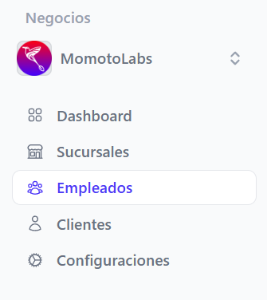
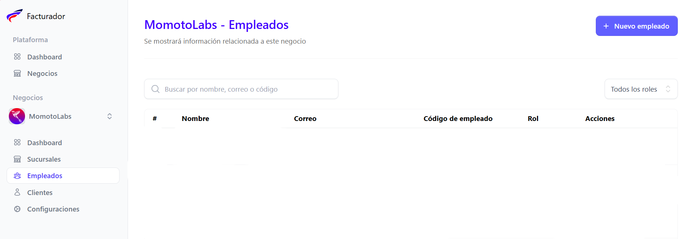
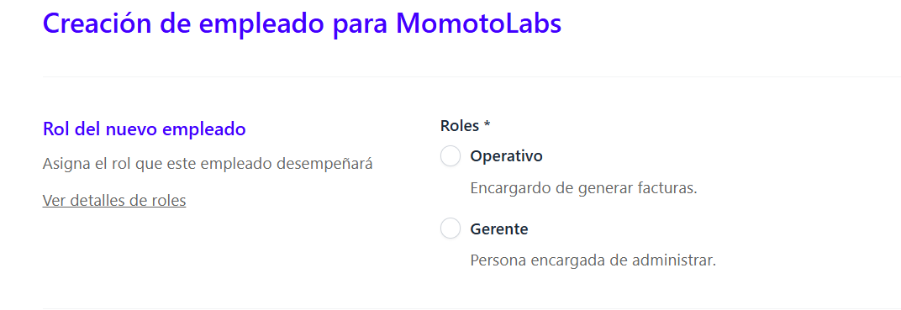
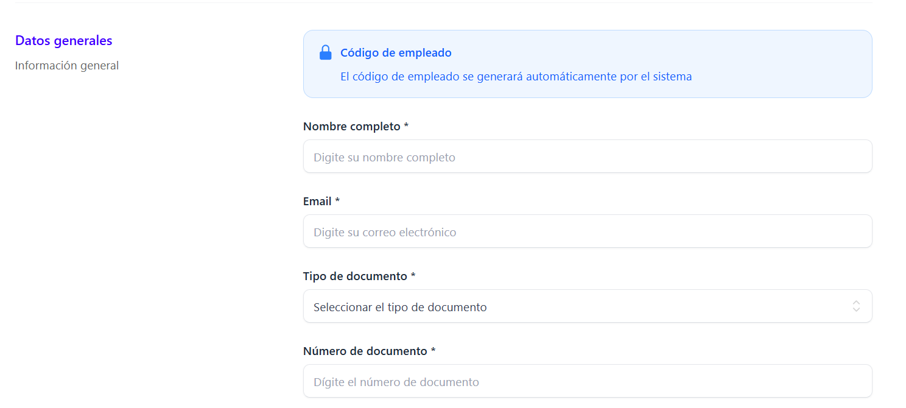
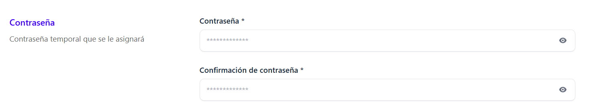
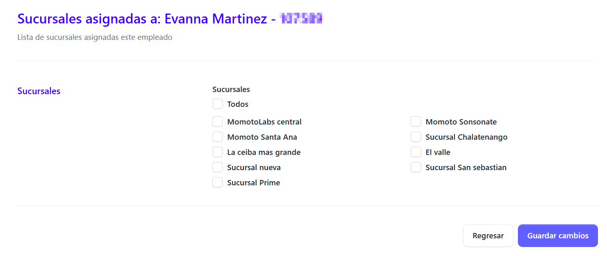
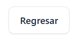

La opción Crear empleados permite registrar al personal que utilizará el sistema facturador, asignándole datos básicos como nombre, correo, rol de usuario, entre otros datos que son necesarios Con esta función se asegura un control adecuado de accesos y responsabilidades dentro de la plataforma.

Para poder acceder al panel de empleados, basta posicionarse en el menú lateral izquierdo y seleccionar la opción Empleados

 se desplegara la pantalla principal de este módulo.

Para crear un nuevo empleado dar clic en el botón Nuevo empleado que esta situado en la esquina superior derecha de la pantalla 

Automáticamente se despliega el formulario de registro de nuevo empleado, donde hay que completar campos de caracter obligatorio.

## Rol de usuario 

Se debe asignar un rol para el nuevo empleado, los cuales pueden ser:
 
 
 
 - Operativo
 - Gerente

Si el administrador desea conocer detalles de cada rol puede dar clic en el enlace llamado **Ver detalles de roles** que esta en la parte inferior de esta sección.

## Datos generales del empleado

En esta sección se deben completar los campos de caracter obligatorio (*)

- Nombre completo del empleado
- Correo electrónico
- Tipo de documento (DUI/NIT/Pasaporte/Carnet de residente/Otro)
- Número de documento (Debe ser un documento valido, es decir existente)

**Nota aclaratoria: El código de empleado se genera automáticamente por el sistema, y se envia mediante correo electrónico a la dirección que el empleado proporcionó**

## Contraseña

El administrador asignara una contraseña de forma temporal, que debera ser cambiada en el primer inicio de sesión del empleado por motivos de seguridad.

Se debe ingresar contraseña y confirmación de contraseña, estas deben ser iguales.

Si los datos proporcionados en el formulario son correctos, dar clic en el botón **Registrar empleado**

Si el empleado se registro exitosamente se muestra el siguiente mensaje indicando que este se creo con éxito

## Asignación de sucursal después de la creación del empleado

De forma inmedita despues de la creación del empleado se redirige a la sección de asigación de sucursal o sucursales a las que el empleado estara relacionado

Al seleccionar la/s sucursales dar clic en el botón **Guardar cambios** inmediatamente se muestra un mensaje que indica que la sucursal o sucursales se asignarón correctamente.

Pero si se desea dejar la asignación de sucursales para posteriormente asignar de forma manual dar clic en el botón **Regresar**

