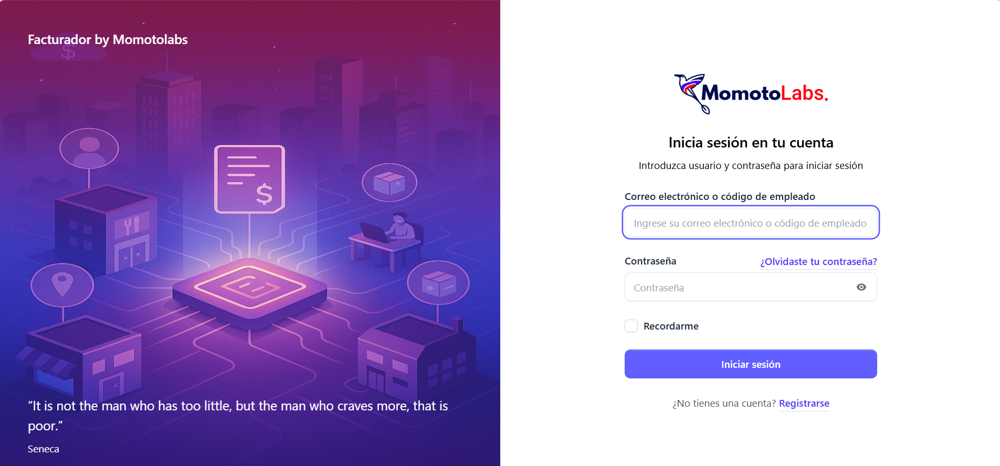
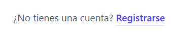
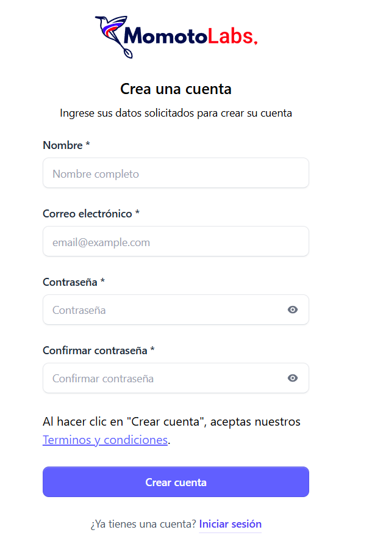
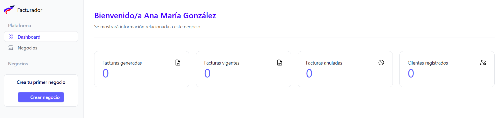

**¡Bienvenido a Billermomotolabs! Hemos preparado una guía paso a paso para que disfrutes de una experiencia sencilla y amigable al usar nuestro sistema. A continuación, te mostramos cómo crear tu cuenta de administrador.**

## Crear cuenta administrador

Ingresa a la siguiente dirección desde tu navegador: [https://biller.momotolabs.com/register](https://biller.momotolabs.com/register).

Automáticamente se muestra la pantalla de **Inicio de sesión**

Dar clic en el enlace que se muestra al pie del formulario, y dar clic en **Registrarse**

Se muestra el siguiente formulario de registro:

 Debes ingresar:

  - Nombre completo

  - Dirección de correo valida 

  - Contraseña 

  - Confirmación de contraseña
  
  
  Al completar los campos solicitados dar clic en  el botón **Crear cuenta**, de forma inmediata tendras acceso a la pantalla de inicio o Dashboard del sistema.

## Pantalla de inicio

Una vez creada la cuenta veras la siguiente pantalla.

el siguiente paso es **crear el negocio**

