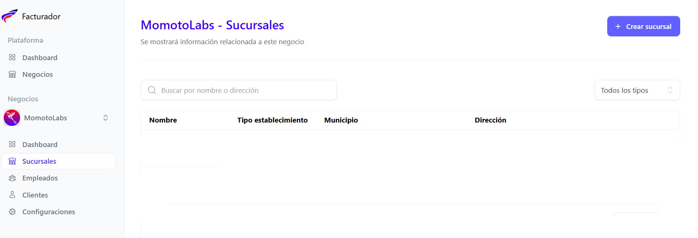
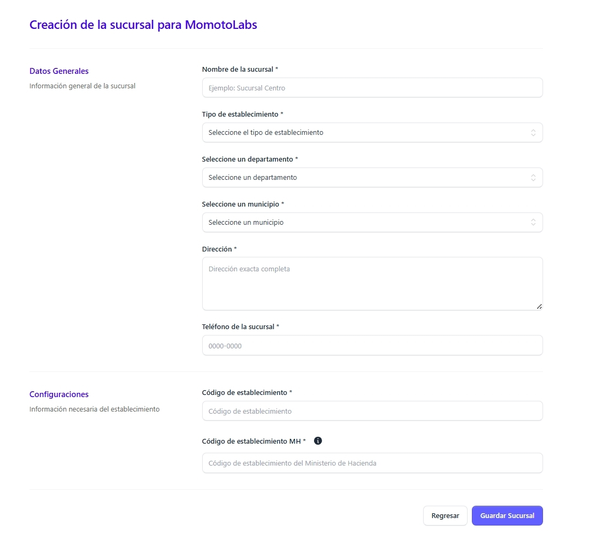

Para crear una nueva sucursal posicionarse en el menú lateral izquierdo que se muestra en pantalla y dar clic en la sección sucursales, posteriormente dar clic en el botón Crear sucursal, ubicado en el lado superior derecho de la pantalla

### Datos generales

Para crear una nueva sucursal basta con llenar los campos requeridos solicitados (*)

- Nombre de la sucursal
- Tipo de establecimiento (Sucursal/ Agencia, Casa matriz, Bodega, Predio y/o patio, Otro)
- Departamento
- Municipio
- Dirección
- Teléfono de la sucursal
 
### Configuraciones

- Código del establecimiento (a opción del cliente / 4 dígitos)
- Código de establecimiento MH (1 letra y 3 números )

Si esta seguro de los datos proporcionados, dar clic en el botón Crear sucursal, si no dar clic en el botón Regresar