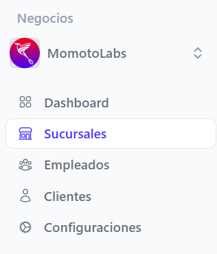

Para crear una nueva sucursal posicionarse en el menú lateral izquierdo que se muestra en pantalla y dar clic en la sección sucursales

Se muestra la pantalla principal de sucursales 

 Posteriormente dar clic en el botón **Crear sucursal,** ubicado en el lado superior derecho de la pantalla

### Datos generales

Para crear una nueva sucursal basta con llenar los campos requeridos solicitados en el formulario(*)

- Nombre de la sucursal
- Tipo de establecimiento (Sucursal/ Agencia, Casa matriz, Bodega, Predio y/o patio, Otro)
- Departamento
- Municipio
- Dirección
- Teléfono de la sucursal
 
### Configuraciones

- Código del establecimiento (a opción del cliente / 4 dígitos)
- Código de establecimiento MH (1 letra y 3 números ) este debe ir en base a al tipo de establecimiento, si es Casa matriz debe ser C001,  Punto de venta P001, Sucursal S001. Para mayor información consultar el sitio [factura.gob.sv](https://factura.gob.sv)

Si esta seguro de los datos proporcionados, dar clic en el botón **Guardar sucursal**, se mostrara el siguiente mensaje indicando que la sucursal fue creada con éxito 

Si no esta seguro de guardar los cambios dar clic en el botón **Regresar**

