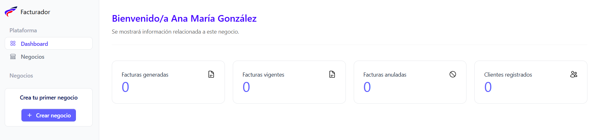
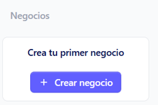

Después de haber creado tu cuenta,automáticamente se muestra la pantalla del Dashboard del negocio

Para poder crear un negocio se puede realizar por dos vias, directamente despues de crear tu cuenta desde el botón Crear negocio 

O ingresando a la sección **Negocios** desde el menú principal

Inmediatamente se despliega la pantalla donde en la parte superior derecha de la pantalla se encuentra el botón **Crear negocio**

Dar clic en dicho botón se despliega el formulario de creación

## Formulario de creación ##

**Datos generales del negocio**

Completa los campos requeridos del negocio (*)

- Nombre del negocio
- Correo electrónico asociado al negocio
- Teléfono del responsable
- Descripción del negocio

### Configuraciones

Completa los campos requeridos (*)

- Nombre comercial del negocio
- Número de NIT
- Número de NRC
- Selecciona del catalogo la actividad económica
- Especifica si el negocio se dedica a exportar (activa el switch)

Si se dedica a exportar completa los datos solicitados

- Tipo de item de exportación (Bienes, servicios, ambos)
- Selecciona el recinto fiscal del negocio del catalogo
- Selecciona el régimen del catalogo

### Certificado del Ministerio de Hacienda

Estos campos serán llenados con la información proporcionada por el Ministerio de Hacienda previamente y que son requeridos para el registro del negocio (*)

- Certificado (.crt)
- Clave de certificado
- Contraseña de API del MH
- Secuencia
- Ambiente de destino (Prueba/ Producción)

Si completo todos los cambios dar clic en el botón **Guardar negocio**, si no esta seguro dar clic en el botón Cancelar.

