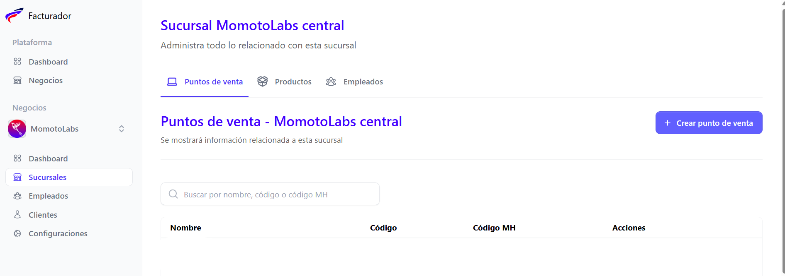
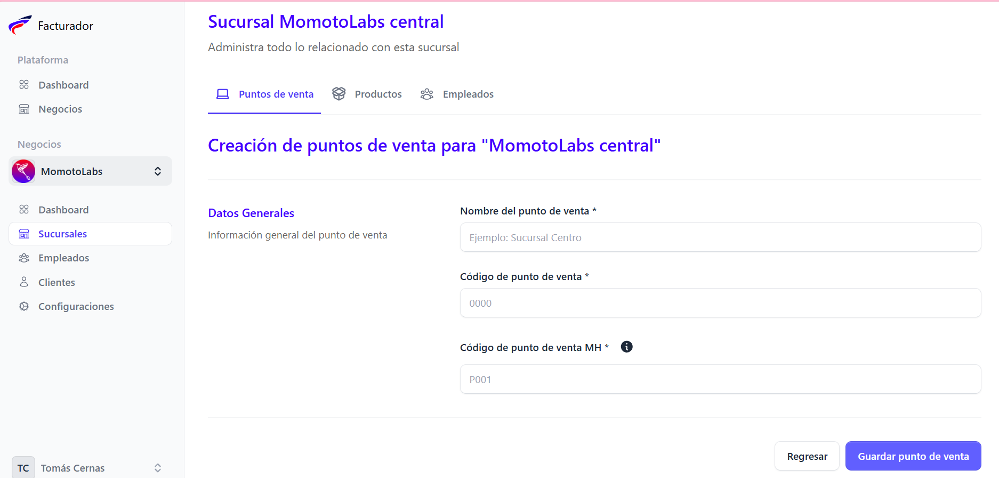

Para crear un punto de venta dentro de una sucursal, accede al menú principal y haz clic en la opción Sucursales

Buscar el área de detalles

Cuando se despliegue la pantalla, haz clic en la sección Puntos de venta

 Y luego en el botón **Crear punto de venta,** ubicado en la parte superior derecha.

## Fomulario de creación de punto de venta

Completar los campos requeridos para la creación del punto de venta

- Nombre del punto de venta
- Código del punto de venta
- Código de punto de venta MH (proporcionado desde el sitio [factura.gob.sv](https://factura.gob.sv))

Una vez completados los campos requeridos, haz clic en el botón **Guardar punto de venta**

Se muestra el mensaje de confirmación de la creación del punto de venta

Si no deseas continuar con la acción, selecciona el botón **Regresar**

