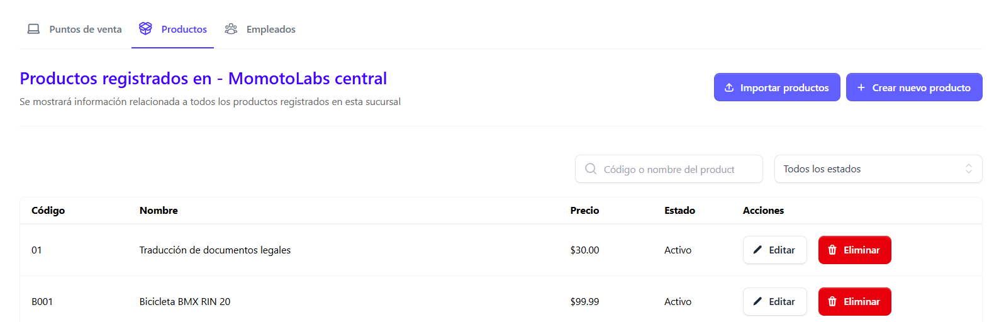

Para poder hacer un registro de productos de forma individual o de carga masiva hay que posicionarse en la sección de Sucursales, ubicada en el menú principal que se encuentra en el lado izquierdo de la pantalla.

Posteriormente posicionarse en la sección de productos.

El usuario debe seleccionar la forma en que cargara productos

## Productos de forma individual

Para cargar productos de forma individual basta con dar clic en el botón Crear nuevo productos.

Al dar clic en Crear nuevo producto se despliega el siguiente formulario:

Donde es necesario completar los campos requeridos:

- Producto (Nombre del producto)
- Código del Producto/Servicio (este puede ser definido por el usuario y un producto no puede tener el mismo código, por ejemplo no pueden existir dos productos con código 001)
- Unidad de medida (seleccionarla del catalogo)
- Precio del producto
- Estado del producto (Activo/Inactivo)

Al completar los campos dar clic en el botón Guardar productos y si no esta seguro de aplicar los cambios dar clic en el botón Regresar

## Carga masiva de productos

Para registrar productos de forma masiva, dar clic en el botón Importar productos

Al haber dado clic en este botón se despliega la siguiente pantalla

Dar clic en el botón descargar plantilla

Al dar clic en descargar plantilla esta se descargara automáticamente en un archivo Excel

Una vez descargada la plantilla, al abrir el archivo se visualiza la siguiente tabla donde se ingresaran datos de los productos a cargar:

- Código del producto (este debe ser único, ya que no pueden existir productos con el mismo código )
- Descripción del producto (Nombre del producto)
- Tipo de producto (Bienes/Servicios /Otros )
- Unidad de medida (seleccionar del catalogo)
- Precio Unitario
 
Guardar los cambios y cargar nuevamente la plantilla, dando clic en la opción Choose file

Al haber cargado la plantilla dar clic en el botón Importar, y los productos se cargaran de forma automática y apareceran en el listado general de productos,de no estar seguro de hacer la carga de productos dar clic en el botón Cancelar.

 

