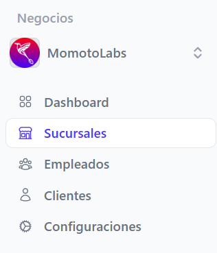
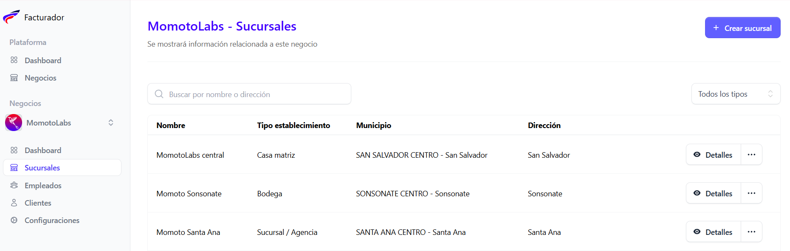
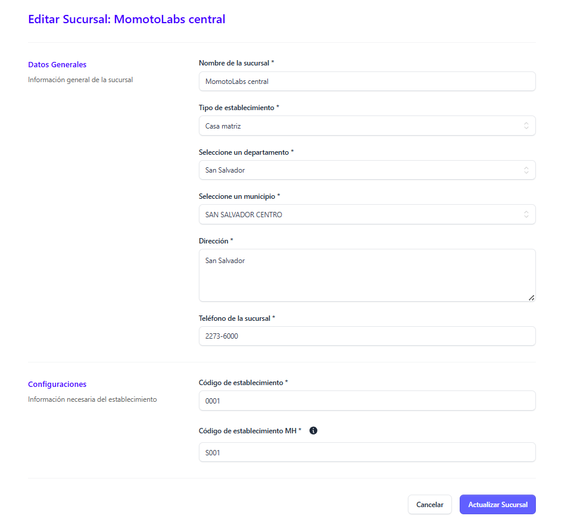
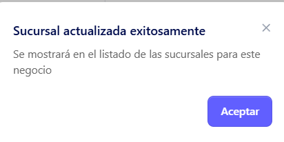

Para editar una sucursal, el usuario debe hacer clic en la opción Sucursales, ubicada en el menú principal del lado izquierdo de la pantalla.

Al ingresar a la sección Sucursales, selecciona la sucursal que deseas editar y haz clic en el ícono de tres puntos ubicado junto al apartado Detalles.

Al seleccionar editar se desplega la pantalla de edición de la sucursal seleccionada

### Datos generales

El usuario puede editar los siguientes campos :

- Nombre de la sucursal

- Tipo de establecimiento (Sucursal/ Agencia, Casa matriz, Bodega, Predio y/o patio, Otro)
- Departamento

- Municipio

- Dirección

- Teléfono de la sucursal

- Código del establecimiento (a opción del cliente / 4 dígitos)

- Código de establecimiento MH (1 letra y 3 números ) este debe ir en base a al tipo de establecimiento, si es Casa matriz debe ser C001,  Punto de venta P001, Sucursal S001. Para mayor información consultar el sitio [factura.gob.sv](https://factura.gob.sv)

Si esta seguro de los cambios realizados, dar clic en el botón Actualizar sucursal

Se mostrará automáticamente un mensaje indicando que la sucursal fue actualizada exitosamente

 Si no esta seguro de aplicar los cambios dar clic en el botón **Cancelar**

 