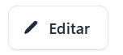

Para realizar la edición de un punto de venta hay que ingresar a la sección de sucursales,

 posicionarse en una sucursal, dar clic en el apartado de Detalles 
 
 

 Se despliega automáticamente la sección de **Puntos de venta**

Ubicarse en la sucursal a editar (de existir varias) y dar clic en editar

 Se despliega el formulario donde se pueden editar campos como:

- Nombre del punto de venta
- Código del punto de venta
- Código de punto de venta MH (proporcionado desde el sitio [factura.gob.sv](https://factura.gob.sv))

Al completar los campos requeridos dar clic en el botón Actualizar punto de venta

Se muestra el siguiente mensaje de confirmación de actualización del punto de venta:

 Si no esta seguro de completar esta acción dar clic en el botón **Regresar**

