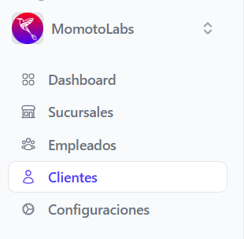
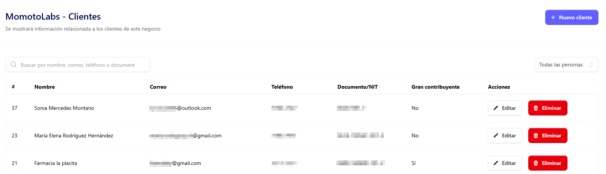

Para poder editar un cliente, hay que posicionarse en la pagina principal de clientes

Donde se muestra el listado de clientes existentes

En la sección de acciones que se muestra en la tabla buscar **Editar**

Al dar clic automáticamente se despliega el formulario de edición del cliente según su tipo

- Cliente Natural
- Cliente Natural Contribuyente 
- Cliente Natural Extranjero
- Cliente Juridico
- Cliente Juridico Extranjero

## Editar cliente natural ##

Al cliente **natural** se le pueden editar los siguientes campos:

- Tipo de cliente (El cliente natural puede pasar a ser jurídico)

- Nombre del cliente (Si hubo algun error de ortografia)

- ¿El cliente es contribuyente ? si no es puede pasar a serlo; activando el switch (Se habilitaran campos NIT,NRC y actividad economica)

- El cliente puede ser gran contribuyente si no lo es (debe activar el switch)

- Tipo de documento (DUI, NIT, Carnet de residente, Pasaporte, Otro)

-  Número de documento (Según el documento selecionado)

- Correo electrónico 

**Nota aclaratoria: La dirección de correo es un dato único para cada cliente, es decir dos o más clientes no puedentener el mismo correo.**

- Departamento de residencia (seleccionarlo de la lista desplegable)

- Municipio (seleccionarlo de la lista desplegable)
- Dirección 

Al completar los cambios dar clic en el botón **Guardar cliente**

se mostrara el siguiente mensaje indicando que el cliente fue actualizado correctamente 

Si no esta seguro de aplicar cambios dar clic en el botón **Regresar**

## Editar cliente natural contribuyente ##

Al cliente **natural contribuyente** se le pueden editar los siguientes campos:

- Tipo de cliente (El cliente natural puede pasar a ser jurídico)

- Nombre del cliente (Si hubo algun error de ortografia)

- ¿El cliente es contribuyente ? si lo es puede dejar de serlo; desactivando el switch (Se ocultaran campos NIT,NRC y actividad economica)

- El cliente puede ser gran contribuyente si no lo es (debe activar el switch)

- Tipo de documento (NIT por defecto unicamente)

- Número de documento (NIT)

- Número de NRC (Si existe alguna inconsistencia)

- Actividad económica (Selecionarla de la lista que se despliega)

- Correo electrónico

**Nota aclaratoria: La dirección de correo es un dato único para cada cliente, es decir dos o más clientes no puedentener el mismo correo.**

- Departamento de residencia (seleccionarlo de la lista desplegable)

- Municipio (seleccionarlo de la lista desplegable)

- Dirección 

Al completar los cambios dar clic en el botón **Guardar cliente**

se mostrara el siguiente mensaje indicando que el cliente fue actualizado correctamente 

Si no esta seguro de aplicar cambios dar clic en el botón **Regresar**

## Editar cliente natural extranjero ##

Al cliente **natural extranjero** se le pueden editar los siguientes campos:

- Tipo de cliente (El cliente natural puede pasar a ser jurídico)

- Nombre del cliente (Si hubo algun error de ortografia)

- ¿El cliente es extranjero ? si lo es puede dejar de serlo; desactivando el switch (Se ocultaran campos Nombre comercial,actividad economica, país)

- El cliente puede ser gran contribuyente si no lo es (debe activar el switch)

- Nombre comercial

- Tipo de documento (Pasaporte, Carnet de residente, Otro)

- Número de documento (Según el tipo de documento seleccionado)

- Actividad económica (Selecionarla de la lista que se despliega)

- Correo electrónico 

**Nota aclaratoria: La dirección de correo es un dato único para cada cliente, es decir dos o más clientes no puedentener el mismo correo.**

- Teléfono (incluyendo área)

- País (seleccionandolo desde la lista desplegable)

- Dirección 

Al completar los cambios dar clic en el botón **Guardar cliente**

se mostrara el siguiente mensaje indicando que el cliente fue actualizado correctamente 

Si no esta seguro de aplicar cambios dar clic en el botón **Regresar**

## Editar cliente jurídico ##

Al cliente **Jurídico** se le pueden editar los siguientes campos:

- Tipo de cliente (El cliente jurídico puede pasar a ser natural)

- El cliente puede ser gran contribuyente si no lo es (debe activar el switch)

- Nombre del cliente (Si hubo algun error de ortografia)

- Nombre comercial

- Número de NRC

- NIT (recordando que el NIT esta ligado al número de NRC)

- Actividad económica (Seleccionar de la lista desplegable)

- Correo electrónico 

**Nota aclaratoria: La dirección de correo es un dato único para cada cliente, es decir dos o más clientes no puedentener el mismo correo.**

- Teléfono 

- Departamento de residencia (seleccionarlo de la lista desplegable)

- Municipio (seleccionarlo de la lista desplegable)

- Dirección 

Al completar los cambios dar clic en el botón **Guardar cliente**

se mostrara el siguiente mensaje indicando que el cliente fue actualizado correctamente 

Si no esta seguro de aplicar cambios dar clic en el botón **Regresar**

## Editar cliente jurídico extranjero ##

Al cliente **Jurídico** se le pueden editar los siguientes campos:

- ¿El cliente es extranjero? activar el switch (Desaparecen los campos de NIT, NRC)

- El cliente puede ser gran contribuyente si no lo es (debe activar el switch)

- Tipo de cliente (El cliente jurídico puede pasar a ser natural)

- Nombre del cliente (Si hubo algun error de ortografia)

- Nombre comercial

- Tipo de documento (Pasaporte, Carnet de residente, Otro)

- Número de documento, según el tipo seleccionado.

- Actividad económica (Seleccionar de la lista desplegable)

- Correo electrónico 

**Nota aclaratoria: La dirección de correo es un dato único para cada cliente, es decir dos o más clientes no puedentener el mismo correo.**

- Teléfono (incluyendo el número de área)

- País

- Dirección 

Al completar los cambios dar clic en el botón **Guardar cliente**

se mostrara el siguiente mensaje indicando que el cliente fue actualizado correctamente 

Si no esta seguro de aplicar cambios dar clic en el botón **Regresar**

