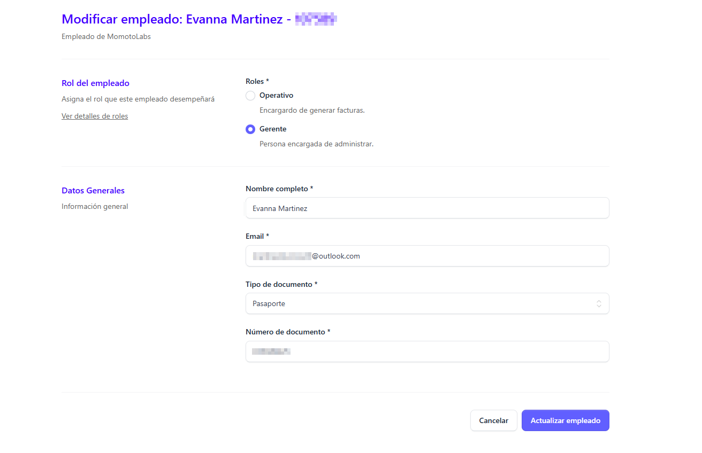

La acción principal de esta función es permitir la actualización, corrección o modificación de la información registrada de cada empleado de manera rápida y segura.

Para editar un empleado hay que posicionarse en la tabla que contiene le lista general de empleados, buscar el empleado a editar 

dar clic en el botón **Editar**

De forma automática se despleiga el formulario de edición, con los datos del empleado a modificar

Los datos que se pueden editar son:

## Rol de usuario

Si el empleado era gerente puede pasar a ser operativo y viceversa.

## Datos generales

El usuario puede modificar los siguientes datos de la información personal del empleado:

- Nombre del empleado
- Correo electrónico
- Cambiar el Tipo de documento (DUI/NIT/Pasaporte/Carnet de residente/Otro)
- Número de documento (Debe ser un documento valido, es decir existente y de acuerdo al tipo de documento que se selecciono)

Al completar los cambios dar clic en el botón Actualizar empleado

Automáticamente se muestra un mensaje indicando que el empleado fue actualizado correctamente

Si no esta seguro de aplicar los cambios dar clic en el botón Cancelar

