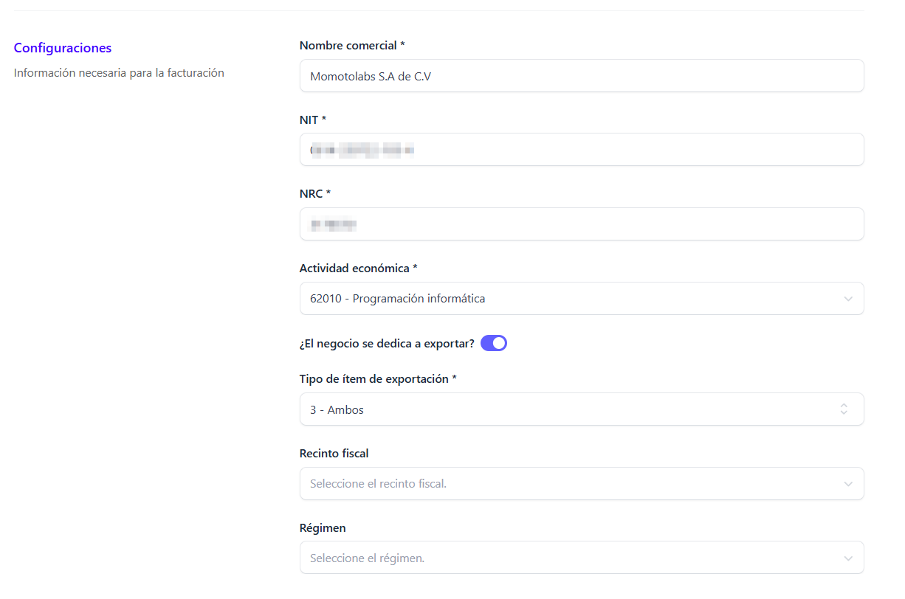
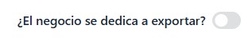

Para poder realizar la edición de un negocio posicionarse en la sección negocios que se encuentra en el menú principal del sistema 

Al dar clic se despliega la pantalla principal donde se muestra el/los negocios registrados 

Posicionarse en el negocio a editar y dar clic en el botón **Editar**

Automáticamente se despliega el formulario de edición donde se pueden modificar:

## Datos generales ##

- Nombre del negocio
- Correo electrónico asociado al negocio
- Teléfono del responsable
- Descripción del negocio

## Configuraciones del negocio ##

- Nombre comercial
- Número de NIT
- Número de NRC 
- Actividad economica (seleccionar del catalogo que se despliega)
- ¿El negocio se dedica a exportar?

Si su respuesta es Si, activar el switch

 
 se habilitan los siguientes campos:

 

 - Tipo de ítem de exportación (1- Bienes 2- Servicios 3- Ambos)
 - Recinto fiscal (Seleccionarlo de la lista desplegable, de ser necesario; este campo es opcional)
 - Régimen (Seleccionarlo de la lista desplegable, de ser necesario; este campo es opcional)

 **Si el negocio no se dedica a la exportación desactivar el switch** (se ocultan los campos anteriormente mencionados)

 

 ## Certificado del Ministerio de Hacienda ##

 Dentro de esta sección se pueden **visualizar** los siguientes campos:

 

 - Certificado actual
 - Clave del certificado
 - Contraseña de API del MH
 
// Estos pueden editarse desde **Configuraciones del negocio/certificado//

 Y **unicamente se pueden modificar** los campos:

 - Secuencia (La secuencia inicia en 1 si el negocio esta recien registrado, pero si viene migrado de otro ambiente continua con la secuencia que tenia previamente)

 - Ambiente (Pruebas/Producción)

 Si esta seguro de los cambios a aplicar dar clic en el botón **Actualizar negocio**

 

Se muestra automáticamente el mensaje que indica que el negocio se actualizo correctamente

Si no esta seguro de aplicar los cambios dar clic en el botón **Regresar**

