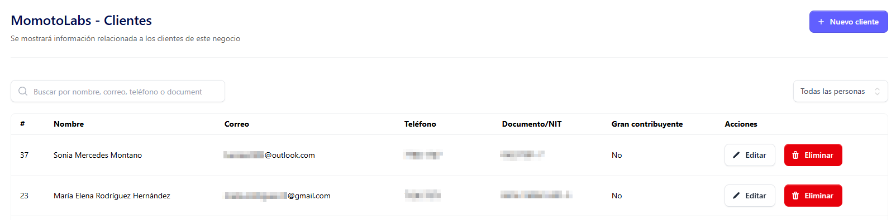
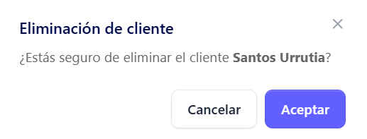
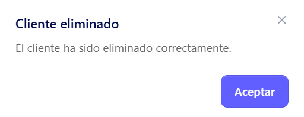

Para poder eliminar un cliente hay que ingresar a la seccion de clientes que se encuentra en el menu principal del sistema 

al dar clic se despliega la lista de clientes existente 

Seleccionar el cliente que desea eliminar, posicionarse en **Acciones**  y buscar el botón eliminar 

Al dar clic en el botón eliminar se despliega el siguiente mensaje de advertencia indicandole al usuario si desea completar la acción de eliminar 

 
 Si esta seguro de completar la acción de eliminar dar clic en el botón **Aceptar**

 

 Y se muestra el mensaje indicando que el cliente fue eliminado correctamente 

 
 

 Si no esta seguro dar clic en el botón **Cancelar**

 