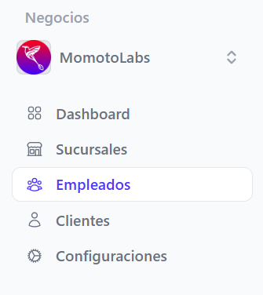

## Reestablecer contraseña empleado ##

Ingresar al menú empleados

Posicionarse en el empleado a editar, en las acciones dar clic al botón editar 

En el formulario que se despliega, al final de la página se encuentra la sección Contraseña. Este campo solo puede ser modificado por el administrador, en caso de que el empleado olvide su contraseña.

Después de asignar la nueva contraseña y confirmar la misma, haga clic en el botón Actualizar empleado para guardar los cambios.

La contraseña será restablecida y el empleado podrá iniciar sesión nuevamente

