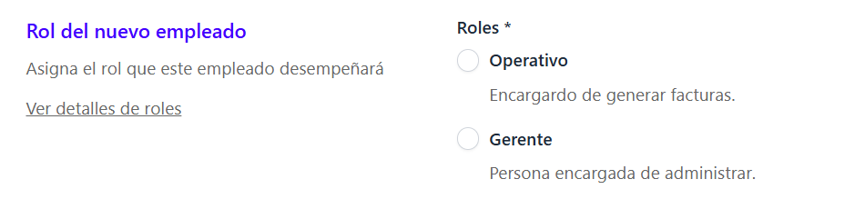
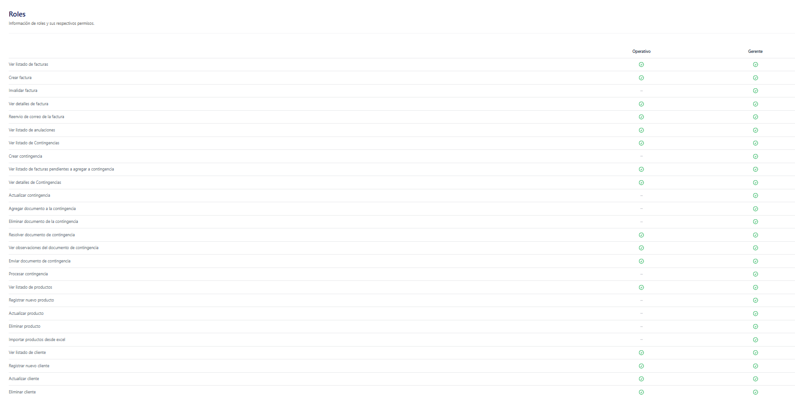

Desde la sección de Administrador, se pueden visualizar dos tipos de roles. Previo a la asignación de estos, ya debe tenerse un negocio registrado.

 Los roles se asignan al momento de hacer el registro de un nuevo empleado, por ende, este paso es crucial para un funcionamiento adecuado del sistema. 

 Los roles se dividen en:

 - Operativo
 - Gerente

 

 Estos poseen ciertos permisos para ejecutar acciones puntuales dentro del sistema, estos pueden ser visualizados en el enlace **Ver detalles de roles**

 

 A continuación se detallan de forma individual:

 ## Permisos del rol Operativo:

Funciones permitidas: Este rol posee permisos para poder ejecutar las siguientes funciones:

•	Ver listado de facturas 

•	Crear facturas 

•	Ver detalles de factura 

•	Reenvió de correo de la factura 

•	Ver listado de anulaciones

•	Ver listado de Contingencias

•	Ver listado de facturas pendientes a agregar a contingencia

•	Ver detalles de Contingencias

•	Resolver documento de contingencia

•	Ver observaciones del documento de contingencia

•	Enviar documento de contingencia

•	Ver listado de productos

•	Ver listado de cliente

•	Registrar nuevo cliente

•	Actualizar cliente

•	Eliminar cliente

## Restricciones para el Rol Operativo

Funciones restringidas:

•	Invalidar factura

•	Crear contingencia

•	Actualizar contingencia

•	Agregar documento a la contingencia

•	Eliminar documento de la contingencia

•	Procesar contingencia

•	Registrar nuevo producto

•	Actualizar producto

•	Eliminar producto

•	Importar productos desde Excel

## Permisos para el Rol de Gerente

Este rol posee permisos para poder ejecutar y administrar todas las funciones del facturador (tiene todos los permisos)
 
 Es decir el Gerente puede:

 •	Ver listado de facturas

•	Crear factura

•	Invalidar factura

•	Ver detalles de factura

•	Reenvió de correo de la factura

•	Ver listado de anulaciones

•	Ver listado de Contingencias

•	Crear contingencia

•	Ver listado de facturas pendientes a agregar a contingencia

•	Ver detalles de Contingencias

•	Actualizar contingencia

•	Actualizar contingencia

•	Eliminar documento de la contingencia

•	Resolver documento de contingencia

•	Ver observaciones del documento de contingencia

•	Enviar documento de contingencia

•	Procesar contingencia

•	Ver listado de productos

•	Registrar nuevo producto

•	Actualizar producto

•	Eliminar producto

•	Importar productos desde Excel

•	Ver listado de cliente

•	Registrar nuevo cliente

•	Actualizar cliente

•	Eliminar cliente

 