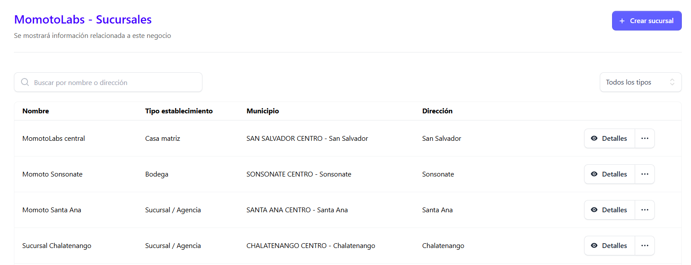

En esta sección el administador visualizara el listado de facturas generadas desde el facturador por sucursal.

Para poder visualizar las facturas emitidas hay que seguir los siguientes pasos:

1- Ingresar al menú **Sucursales**

Se despliega la pantalla que contiene todas las sucursales asociadas al negocio

Posicionarse en la sucursal que se desea visualizar y dar clic en el botón **Detalles** 

De manera automática se despliega la siguiente sección **Facturas emitidas**:

### Lista de facturas emitidas ###

Se muestra el listado de facturas emitidas

### Búsqueda y filtros de facturas ###

Esta función facilita la navegación dentro del sistema para poder encontrar de forma puntual una factura o grupo de facturas, se puede realizar búsqueda por:

- Código de generación
- Filtro por tipo de factura

### Búsqueda por código de generación ###

Desde esta sección se puede buscar de forma puntual una factura por su código de generación desde la siguiente casilla:

### Filtro por tipo de factura ###

Desde este apartado se puede hacer la búsqueda o filtro de facturas de forma conjunta según su tipo:

- Todos los documentos
- Facturas de exportación
- Comprobante de crédito fiscal 
- Factura de sujeto excluido 
- Factura
- Nota de remisión 

### Vista de documento ###

Para visualizar la vista previa del documento, posicionarse en la factura y dar clic en el siguiente icono desde **Acciones**:

 
 Al dar clic se muestra la vista previa del documento generado

 

### Descarga de documentos PDF Y JSON ###

En el lado supeior derecho de cada vista de las facturas se encuentran los botones de descarga de documentos en formato JSON y PDF de la factura correspondiente 

 

 donde al dar clic en cada uno de los botones mencionados anteriormente se descarga de forma automática 

 

